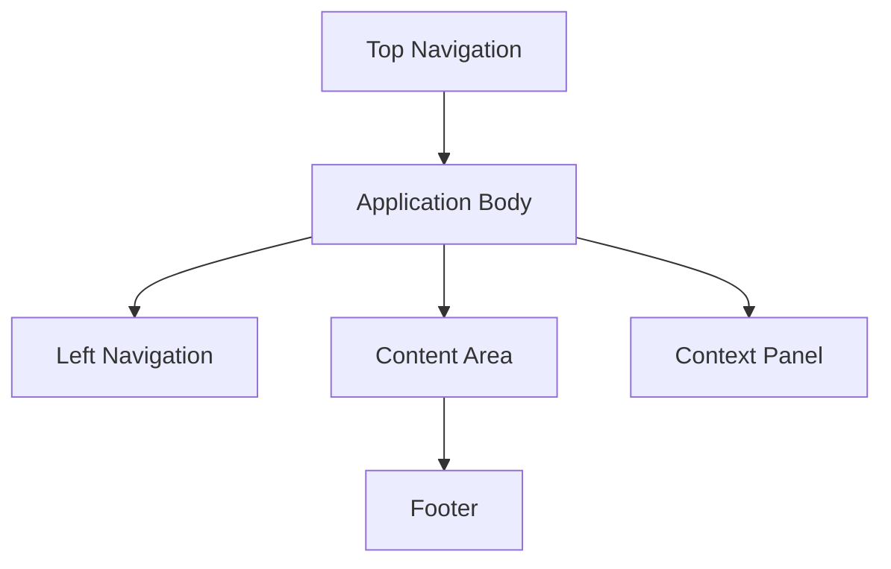
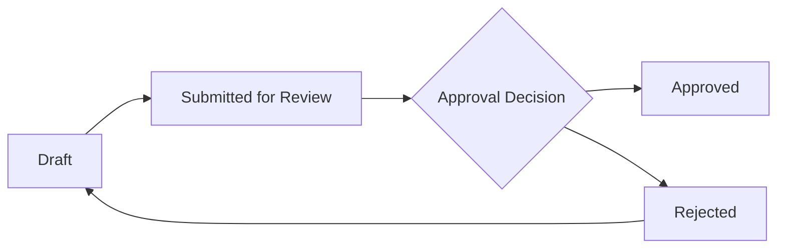
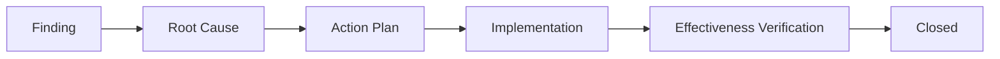
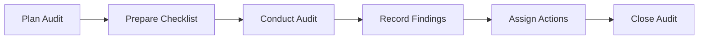
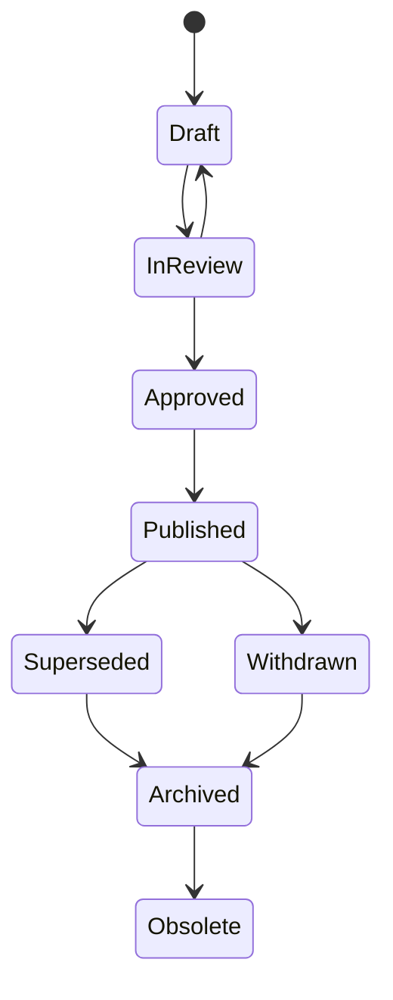

# UI Design System

This document defines the mandatory UI design system for Certisphere React and Next.js development. It governs layout, navigation, dashboards, page templates, component behaviour, controlled information screens, workflow visualisation, accessibility, responsive behaviour, state design, microinteractions, and future Figma mapping.

This is a design and UX governance document. It does not implement UI components. Future implementation must translate this standard into production components through the approved application architecture and design-system package.

Related standards:

- [Design Tokens](DESIGN_TOKENS.md)
- [Typography](TYPOGRAPHY.md)
- [Iconography](ICONOGRAPHY.md)
- [Colour System](COLOUR_SYSTEM.md)
- [UI Branding](UI_BRANDING.md)
- [Brand Governance](BRAND_GOVERNANCE.md)
- [Brand Review Checklist](BRAND_REVIEW_CHECKLIST.md)

## Design Principles

### Professional

Certisphere UI must feel credible for quality managers, auditors, consultants, executives, and certification-facing users. The interface should communicate control, traceability, and operational confidence.

Professional UI means:

- Clear hierarchy.
- Precise labels.
- Evidence-led status information.
- No decorative clutter.
- No unsupported claims in interface copy.
- Consistent use of Certisphere brand language.

### Minimal

Minimal does not mean sparse. Certisphere is an operational SaaS platform, so screens may contain dense information where needed, but visual treatment must remain calm and purposeful.

Minimal UI means:

- Every visible element has a job.
- Repeated patterns are predictable.
- Secondary controls stay visually secondary.
- Empty space supports comprehension.
- Cards are used for repeated items, modals, and framed tools only.

### Enterprise

Certisphere must support multi-tenant, role-aware, audit-ready enterprise workflows.

Enterprise UI means:

- Clear organisation context.
- Permission-aware actions.
- Audit and lifecycle visibility.
- Tables that support scanning, filtering, sorting, and bulk review.
- Workflows that show state, ownership, due dates, and next action.
- No hidden destructive operations.

### Accessible

Accessibility is a product requirement. Interfaces must meet WCAG 2.2 AA expectations and support keyboard, screen reader, reduced-motion, and responsive use.

Accessible UI means:

- Visible focus states.
- Sufficient contrast.
- Semantic structure.
- Keyboard-operable controls.
- Descriptive labels and names.
- Status changes communicated programmatically where applicable.

### Fast

The UI must feel responsive for repeated operational work.

Fast UI means:

- Loading states appear quickly.
- Primary actions remain easy to find.
- Long-running operations show progress or queued state.
- Tables and dashboards avoid unnecessary visual weight.
- Navigation preserves context.

### Consistent

Certisphere users move between controlled information, audits, evidence, risks, training, suppliers, and management review. Patterns must remain consistent across modules.

Consistent UI means:

- Shared layout framework.
- Shared component behaviour.
- Shared terminology.
- Shared status language.
- Shared lifecycle visualisation.
- Shared accessibility conventions.

## Layout Framework

Certisphere uses an enterprise application shell with top navigation, left navigation, content area, optional context panel, and footer.



### Top Navigation

Top navigation provides global product context and account-level utilities.

Required elements:

- Certisphere logo.
- Organisation switcher.
- Global search entry point.
- Notifications.
- Help or support entry point.
- User menu.

Top navigation must remain stable across authenticated applications.

### Left Navigation

Left navigation provides module-level movement.

Required behaviour:

- Display only modules available to the user.
- Indicate active module.
- Support collapsed and expanded states.
- Preserve keyboard navigation.
- Use icons from [Iconography](ICONOGRAPHY.md) with accessible labels.

Primary module order should follow operational importance:

- Dashboard.
- Controlled Information.
- Workflow.
- Evidence.
- Audits.
- Risks.
- Suppliers.
- Training.
- Management Review.
- Reports.
- Administration.

### Content Area

The content area is where primary work happens.

Required structure:

- Page header.
- Breadcrumbs where hierarchy exists.
- Primary action area.
- Filters or view controls where applicable.
- Main content.
- State messaging for loading, empty, error, and success states.

Content width should support dense operational work without turning list and detail screens into marketing layouts.

### Context Panel

The context panel provides secondary information without interrupting the main workflow.

Use for:

- Metadata.
- Permissions.
- Related evidence.
- Related clauses.
- Activity history.
- Comments.
- Review notes.
- Workflow steps.

The context panel must be optional, collapsible, and keyboard accessible.

### Footer

The footer is minimal inside authenticated product UI.

Use for:

- Copyright.
- Release version.
- Environment indicator where appropriate.
- Support or legal links where appropriate.

The footer must not compete with operational content.

## Navigation Standards

### Global Navigation

Global navigation must show where the user is, which organisation they are working in, and which major product area is active.

Global navigation must not expose modules for which the user has no access.

### Organisation Switcher

The organisation switcher is mandatory for users with access to more than one organisation.

Requirements:

- Show current organisation name.
- Support search when the user has many organisations.
- Clearly separate customer, consultant, auditor, and certification-body contexts where applicable.
- Confirm or preserve unsaved work before switching organisation.
- Never rely on client-side switching alone for tenant isolation.

### Breadcrumbs

Breadcrumbs are required for deep resource views.

Example:

```text
Controlled Information / Quality Manual / Revision 4 / Approval
```

Rules:

- Use nouns, not implementation names.
- Keep each level clickable where safe.
- Do not include raw UUIDs unless no meaningful label exists.

### Search

Search must respect permissions and tenant isolation.

Search entry points:

- Global search for cross-module authorised results.
- Local search for table or page-specific results.
- Advanced search for controlled information and evidence where required.

Search results must show resource type, title, lifecycle state, owner, and last updated date where useful.

### Notifications

Notifications must support operational urgency without becoming noise.

Use notifications for:

- Assigned approvals.
- Workflow tasks.
- Failed imports or exports.
- Mentioned comments.
- Audit or CAPA actions.
- Security-relevant account events.

Notifications must be filterable and markable as read.

### User Menu

The user menu includes:

- Profile.
- Security settings.
- Sessions.
- Preferences.
- Support.
- Logout.

Administrative links must appear only when authorised.

## Dashboard Design

Dashboards must help users decide what needs attention. They are not marketing pages.

Dashboard cards and charts must be restrained, scannable, and linked to actionable detail.

### Executive Dashboard

Purpose: give leadership visibility of management-system health.

Recommended content:

- Certification readiness.
- Open high-risk issues.
- Overdue approvals.
- Audit programme status.
- CAPA status.
- Management review readiness.
- Trend summaries.

### Quality Dashboard

Purpose: support quality managers responsible for daily system operation.

Recommended content:

- Controlled information needing review.
- Pending approvals.
- Published and expiring documents.
- Evidence gaps.
- Open findings.
- CAPA ageing.
- Process owner actions.

### Audit Dashboard

Purpose: show audit programme execution and readiness.

Recommended content:

- Scheduled audits.
- Audit scope.
- Open findings.
- Evidence requests.
- Auditor assignments.
- Overdue corrective actions.
- Certification body access events.

### Risk Dashboard

Purpose: show risk and opportunity status.

Recommended content:

- High risks.
- Risk treatment status.
- Overdue reviews.
- Risk by process.
- Related evidence.
- Related audit findings.

### Training Dashboard

Purpose: show competence and training obligations.

Recommended content:

- Training due.
- Competence gaps.
- Role requirements.
- Completion trends.
- Evidence of competence.

### Supplier Dashboard

Purpose: show supplier assurance status.

Recommended content:

- Approved suppliers.
- Supplier review due dates.
- Supplier risks.
- Supplier findings.
- Required evidence.
- Performance trends.

## Page Templates

### List Page

Use for collections such as documents, audits, risks, suppliers, training records, and users.

Required elements:

- Page title.
- Primary action.
- Filters.
- Search.
- Sortable table or structured list.
- Pagination.
- Empty state.
- Error state.
- Bulk action controls where authorised.

### Detail Page

Use for a single resource.

Required elements:

- Resource title.
- Lifecycle or status chip.
- Key metadata.
- Primary actions.
- Tabs or sections for details, relationships, evidence, workflow, history, and comments.
- Context panel where useful.

### Wizard

Use for multi-step creation or setup tasks.

Required elements:

- Step indicator.
- Clear step title.
- Validation per step.
- Save draft where workflow risk requires it.
- Back and next actions.
- Final review before submit.

### Dashboard

Use for summaries and action triage.

Required elements:

- Role-appropriate metrics.
- Actionable sections.
- Timeframe controls where relevant.
- Drill-through links.
- Empty or low-data state.

### Settings

Use for user, organisation, security, notification, and preference configuration.

Required elements:

- Clear grouping.
- Save and cancel actions.
- Change confirmation for sensitive settings.
- Audit-aware messaging for administrative changes.

### Administration

Use for high-privilege organisation and platform operations.

Required elements:

- Permission checks.
- Clear risk messaging.
- Confirmation for destructive or security-sensitive changes.
- Audit trail access.
- Separation between customer administration and platform administration.

## Component Standards

### Buttons

Button hierarchy:

- Primary: one main action per region.
- Secondary: common alternative actions.
- Tertiary: low-emphasis actions.
- Destructive: irreversible, security-sensitive, or high-risk actions.

Buttons must have accessible names, visible focus states, disabled states, loading states, and stable width where label changes could cause layout shift.

### Cards

Cards are used for repeated items, dashboards, modals, and framed tools.

Rules:

- Do not nest cards inside cards.
- Keep radius at or below the governed medium radius.
- Avoid decorative shadow stacking.
- Include clear heading and action affordance where clickable.

### Tables

Tables are the default for operational collections.

Requirements:

- Column headers.
- Sort indicators.
- Filter compatibility.
- Pagination.
- Row actions.
- Keyboard navigation.
- Empty, loading, and error states.
- Truncated content must remain accessible.

### Forms

Forms must support fast and accurate data entry.

Requirements:

- Label every input.
- Show required fields.
- Validate before submit and on relevant interaction.
- Provide field-level and summary errors.
- Preserve user input after validation errors.
- Use appropriate controls for dates, enums, toggles, and numeric values.

### Tabs

Tabs organise peer sections within a resource.

Rules:

- Use tabs only where sections are at the same hierarchy.
- Keep tab labels short.
- Preserve active tab in URL or state where useful.
- Ensure keyboard support.

### Accordions

Accordions hide secondary detail.

Rules:

- Do not hide primary required actions.
- Use descriptive headings.
- Preserve expanded state where useful.
- Ensure keyboard and screen reader support.

### Modals

Modals interrupt the workflow and must be used sparingly.

Use for:

- Confirmation.
- Focused creation.
- Security-sensitive actions.
- Short review decisions.

Modals must trap focus, support Escape where safe, provide clear close controls, and return focus to the invoking element.

### Drawers

Drawers support contextual work without leaving the current page.

Use for:

- Metadata inspection.
- Comments.
- Activity history.
- Relationship previews.
- Evidence previews.

Drawers must not become full replacement pages.

### Alerts

Alerts communicate system state, validation, security, or workflow consequences.

Alert types:

- Information.
- Success.
- Warning.
- Error.

Alerts must not rely on colour alone.

### Badges

Badges identify small categorical information such as classification, module, or role.

Badges must stay compact and readable.

### Status Chips

Status chips show lifecycle or operational state.

Examples:

- Draft.
- In Review.
- Approved.
- Published.
- Superseded.
- Archived.
- Withdrawn.
- Obsolete.

Status chips must be text-first with colour as secondary reinforcement.

### Progress Indicators

Use progress indicators for long-running work, multi-step workflows, imports, exports, and background processing.

Progress must communicate:

- Current state.
- Whether user action is needed.
- Whether the operation can be cancelled.
- What happens next.

## Controlled Information Screens

### Document List

The document list must support operational control.

Required columns:

- Title.
- Document number.
- Classification.
- Lifecycle state.
- Owner.
- Current revision.
- Review due date.
- Last updated.

Required controls:

- Search.
- Filter by lifecycle state.
- Filter by classification.
- Filter by owner.
- Filter by process or clause where available.
- Sort.
- Pagination.

### Document Viewer

The document viewer must make status and authority obvious.

Required elements:

- Title and document number.
- Current revision.
- Lifecycle state.
- Classification.
- Owner.
- Effective date where published.
- Approval status.
- Related clauses.
- Related process.
- Evidence links.
- Revision history access.

Published controlled information must not look editable.

### Revision Comparison

Revision comparison must support review and audit.

Required elements:

- Compared revision numbers.
- Change summary.
- Side-by-side or inline difference view.
- Reviewer comments.
- Approval status.
- Link to source revisions.

### Approval Screen

Approval screens must make accountability explicit.

Required elements:

- Item under approval.
- Current lifecycle state.
- Required approval role.
- Assigned approver.
- Due date.
- Change summary.
- Evidence or comparison.
- Approve and reject actions.
- Electronic signature where required.

### Publication Screen

Publication screens must show the impact of publishing.

Required elements:

- Revision to publish.
- Effective date.
- Distribution scope.
- Superseded revision.
- Related records or relationships affected.
- Confirmation before publication.

### Relationship Viewer

Relationship views must show how controlled information connects to the management system.

Required relationship types:

- Clause mapping.
- Process link.
- Evidence link.
- Parent and child controlled information.
- Supersedes and superseded by.
- Related risks, audits, CAPA, training, and suppliers where available.

### Evidence Viewer

Evidence views must preserve traceability.

Required elements:

- Evidence title.
- Source.
- Owner.
- Collection date.
- Related clause.
- Related process.
- Related audit or workflow.
- Retention status.
- Access restrictions.

## Workflow Visualisation

Workflow visualisations must show state, ownership, decision points, and next action.

### Approval Flow



### CAPA Flow



### Audit Flow



### Document Lifecycle



## Colour Usage

Colour usage must follow [Design Tokens](DESIGN_TOKENS.md) and [Colour System](COLOUR_SYSTEM.md).

Rules:

- Use Midnight Navy for authority, headings, and dark structural surfaces.
- Use Corporate Navy for navigation and secondary structure.
- Use Azure Blue for primary actions, links, focus, and active states.
- Use Bright Sky Blue only for highlights and measured emphasis.
- Use semantic colours only for state.
- Do not introduce unapproved palettes.
- Do not rely on colour alone for meaning.

## Typography

Typography must follow [Typography](TYPOGRAPHY.md) and [Design Tokens](DESIGN_TOKENS.md).

Rules:

- Use Aptos or approved fallbacks.
- Keep body text readable.
- Use hierarchy to support scanning.
- Use semibold for headings and key labels.
- Use underlines only for links.
- Avoid negative letter spacing.
- Do not use hero-scale type inside dense operational panels.

## Icons

Icons must follow [Iconography](ICONOGRAPHY.md).

Rules:

- Use icons to support recognition, not decoration.
- Pair unfamiliar icons with labels or tooltips.
- Use consistent size and stroke.
- Use semantic icons consistently across modules.
- Icons must have accessible names where interactive.

## Accessibility

Certisphere UI must meet WCAG 2.2 AA expectations.

### Keyboard Navigation

Requirements:

- All interactive elements must be keyboard reachable.
- Focus order must follow visual and logical order.
- Modals and drawers must manage focus.
- Keyboard shortcuts must not conflict with browser or assistive technology shortcuts.

### Contrast

Requirements:

- Text and interactive controls must meet WCAG 2.2 AA contrast.
- Disabled states must remain understandable.
- Focus indicators must be visible against their background.

### Focus States

Requirements:

- Every interactive element must have a visible focus state.
- Focus must not be removed for aesthetic reasons.
- Focus rings must use approved focus tokens.

### Screen Readers

Requirements:

- Use semantic headings.
- Use labelled form controls.
- Use table headers.
- Announce loading and validation states where needed.
- Provide descriptive accessible names for icon buttons.

## Responsive Behaviour

### Desktop

Desktop is the primary environment for complex operational work.

Expected behaviour:

- Full navigation shell.
- Data tables with full controls.
- Optional context panel.
- Multi-column layouts where useful.

### Tablet

Tablet layouts must preserve core workflows.

Expected behaviour:

- Collapsible left navigation.
- Context panel becomes drawer where space is limited.
- Tables may use priority columns.
- Touch targets remain usable.

### Mobile

Mobile must support review, approval, triage, and lightweight workflows.

Expected behaviour:

- Bottom or collapsed navigation where appropriate.
- Single-column content.
- Cards or compact rows for table alternatives.
- Sticky primary actions only when they do not obscure content.
- Complex authoring may redirect users to desktop where justified and documented.

## Empty States

Empty states must explain the situation and show the next permitted action.

Empty states should include:

- Short title.
- Clear explanation.
- Primary action where authorised.
- Secondary link to documentation or related setup where useful.

Empty states must not expose actions the user cannot perform.

## Loading States

Loading states must appear quickly and preserve layout stability.

Use:

- Skeletons for table and card content.
- Spinners only for short contained actions.
- Progress indicators for long-running tasks.
- Clear messages for queued background work.

## Error States

Error states must be calm, specific, and recoverable where possible.

Required content:

- Safe user-facing message.
- Correlation ID where useful for support.
- Retry action where appropriate.
- Link or action to resolve missing permission, invalid state, or unavailable service where applicable.

Error states must not expose stack traces, internal service names, secrets, or database details.

## Success States

Success states must confirm outcome without blocking continued work.

Use:

- Toasts for simple completion.
- Inline confirmation for forms.
- Status updates for workflow changes.
- Redirect only when the next workflow step clearly requires it.

## Microinteractions

### Hover

Hover should clarify interactivity. It must not be the only indicator of available action.

### Focus

Focus must be visible and consistent across buttons, links, inputs, tabs, menus, and table rows.

### Validation

Validation must guide correction.

Rules:

- Show field-level validation near the field.
- Provide a form-level summary for multiple errors.
- Preserve entered values.
- Do not validate destructively while the user is still typing unless the rule is simple and non-disruptive.

### Transitions

Transitions should be short, purposeful, and respectful of reduced-motion preferences.

Use transitions for:

- Menu opening.
- Drawer entry.
- Tab change.
- Validation feedback.
- Loading-to-ready state.

## Motion Guidelines

Motion must follow [Design Tokens](DESIGN_TOKENS.md).

### Animation Timing

Use:

- `120ms` for hover, focus, and small state transitions.
- `180ms` for menus, drawers, panels, and standard disclosure.
- Longer animations only for progress or intentionally queued operations.

### Panel Transitions

Panels should slide or fade in a restrained way. Motion must not obscure content, block keyboard use, or distract from operational tasks.

### Loading Behaviour

Loading behaviour must:

- Avoid layout shift.
- Show progress for long-running actions.
- Allow cancellation where supported.
- Respect reduced-motion settings.

## Future Figma Mapping

This document will map to future Figma libraries and component sets.

Expected Figma structure:

- Foundations: colour, typography, spacing, radius, shadow, motion, icons.
- Layout: application shell, grid, navigation, page regions.
- Components: buttons, inputs, tables, cards, tabs, accordions, modals, drawers, alerts, badges, status chips.
- Patterns: list page, detail page, wizard, dashboard, settings, administration.
- Domain screens: controlled information, approvals, publication, evidence, workflow, audit, risk, training, suppliers.
- States: empty, loading, error, success, disabled, permission denied.

Figma components must map to governed design tokens and must not introduce unapproved visual language. When Figma becomes the design source for component specifications, this document remains the governance standard for intent, accessibility, and product behaviour.

