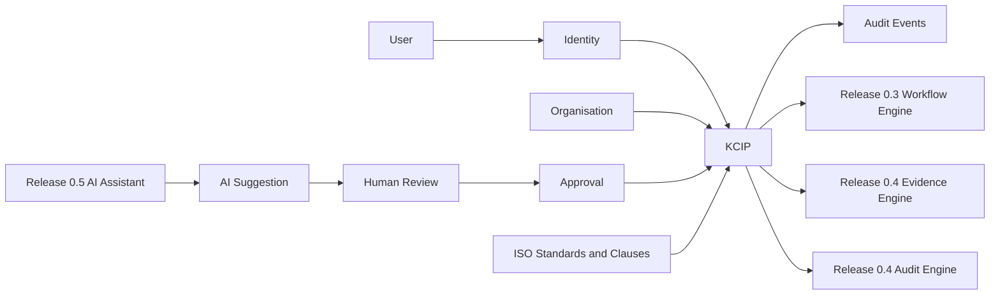
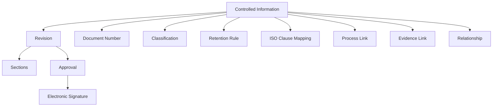
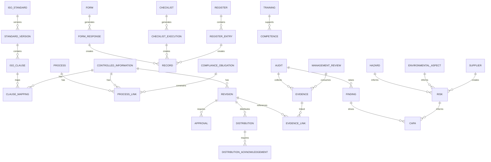
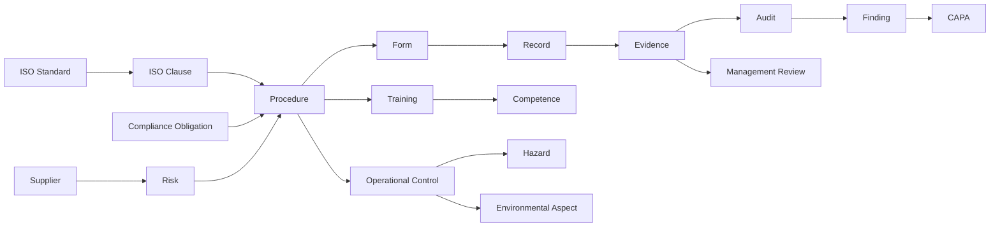
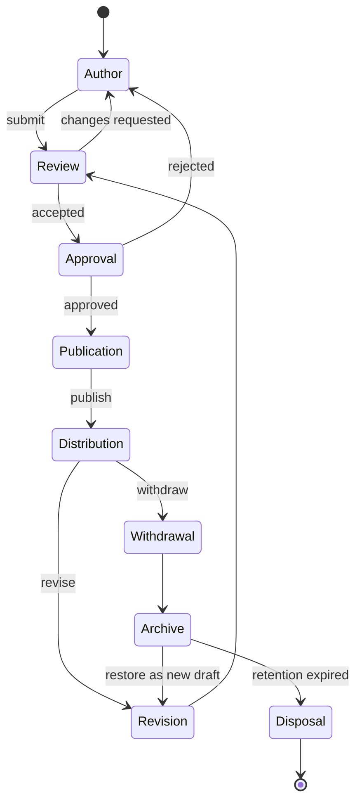

# SPEC-0001: Knowledge & Controlled Information Platform

Status: Planning Complete - Refined by Release 0.1.3

Release: 0.2

Owner: Product Governance

Related Documents:

- [Product Vision](../product/PRODUCT_VISION.md)
- [Product Principles](../product/PRODUCT_PRINCIPLES.md)
- [Product Roadmap](../product/PRODUCT_ROADMAP.md)
- [Domain Model](../product/DOMAIN_MODEL.md)
- [Architecture Decisions](../product/ARCHITECTURE_DECISIONS.md)
- [Engineering Design Review](../DESIGN_REVIEW.md)
- [Design Review Response](../DESIGN_REVIEW_RESPONSE.md)

## 1. Executive Summary

### Purpose

The Knowledge & Controlled Information Platform, abbreviated KCIP, establishes the core Certisphere capability for governing controlled information across ISO management systems. KCIP provides the structures, lifecycle, revision control, numbering, permissions, auditability, and integration contracts required to manage policies, procedures, forms, registers, checklists, templates, records, evidence links, and clause mappings.

### Business Objectives

- Replace uncontrolled shared-drive document practices with governed information lifecycle management.
- Enable organisations to prove that controlled information is current, approved, published, traceable, and retained.
- Provide a foundation for ISO 9001, ISO 14001, ISO 45001, ISO 27001, and future management standards.
- Prepare the platform for workflow automation, audit evidence, AI assistance, and certification readiness reporting.
- Preserve human accountability for all controlled changes.

### Scope

Release 0.2 covers engineering specification for:

- Controlled information domain model.
- Records, forms, checklists, registers, generated records, and evidence traceability model.
- Distribution, acknowledgement, effective-date, and periodic-review controls.
- Approval independence and electronic-signature governance.
- Document and template structure.
- Revision control and lifecycle states.
- Numbering engine architecture.
- Relationship model for standards, clauses, processes, evidence, risk, audit, CAPA, suppliers, training, competence, and management review.
- ISO 45001 compatibility model for hazards, incidents, operational controls, consultation, competence, emergency preparedness, and compliance obligations.
- REST API design.
- Database design.
- Security, retention, electronic signatures, and audit trail requirements.
- Migration strategy for uploaded Word documents.
- Implementation sprint plan.

### Out of Scope

- Application implementation.
- API implementation.
- Prisma schema changes.
- Database migrations.
- Workflow engine implementation.
- Evidence engine implementation.
- AI assistant implementation.
- UI implementation.
- Bulk migration execution.

### Dependencies

- Identity and Organisation bounded contexts.
- Tenant isolation and RBAC.
- Immutable audit event foundation.
- PostgreSQL and Prisma migration workflow.
- Future Release 0.3 Workflow Engine.
- Future Release 0.4 Audit & Evidence Engine.
- Future Release 0.5 AI Quality Assistant.

### Success Criteria

- Engineering teams can implement Release 0.2 without needing product reinterpretation.
- Every controlled information entity has purpose, relationships, lifecycle, validation rules, and extension points.
- API and database designs are specific enough for implementation planning.
- Approval independence, organisation isolation, relationship normalisation, distribution control, and records modelling are defined before Sprint 2.1.
- AI, workflow, audit, evidence, and standards integrations are defined without implementing them.
- The implementation plan is divided into sequenced sprints with dependencies and risks.

## 2. Product Principles

### Controlled Information First

Every controlled artefact must have ownership, classification, lifecycle state, revision history, access policy, approval status, and retention policy.

### Evidence First

KCIP must produce evidence of control by default: authorship, review, approval, publication, distribution, withdrawal, archive, and disposal events.

### AI Assists

AI may draft, summarise, compare, classify, and suggest relationships. AI output is always advisory until accepted by an authorised human.

### Human Approval Required

No controlled information can be published, withdrawn, restored, or disposed without a human approval path.

### Multi-standard by Design

KCIP must support mapping controlled information to ISO 9001, ISO 14001, ISO 45001, ISO 27001, and future standards without duplicating content.

### API First

Every business capability must have a documented API contract before implementation. UI workflows consume the same business APIs.

### SaaS First

All data and access checks must be organisation-scoped. Cross-tenant access must fail by design.

### Security by Default

Sensitive records require least-privilege access, immutable audit history, encrypted storage where appropriate, and secure retention controls.

### Auditor Friendly

Auditors must be able to inspect published information, approvals, revisions, evidence links, and clause mappings without seeing unauthorised drafts.

### Offline Capability

The domain must support future offline evidence packs, export bundles, and controlled read-only review packages.

## 3. Architecture Overview

KCIP is a bounded capability within the Documents and Knowledge domain. It depends on Identity and Organisation for authentication, tenant isolation, membership, and RBAC. It publishes audit events and exposes integration seams for future Workflow, Evidence, Audit, and AI capabilities.

### Authentication Integration

All KCIP endpoints require authenticated principals except explicitly public read-only resources, which are not planned for Release 0.2. Access tokens must include user identity, selected organisation identity, session identity, membership identity, and permissions.

### Organisation Integration

Every KCIP entity belongs to exactly one organisation unless it is globally managed ISO reference data. Organisation membership and access policy determine whether a user can author, review, approve, publish, audit, or administer controlled information.

Multi-organisation users must operate inside an explicit selected organisation context. API requests must validate that the selected organisation in the authenticated principal matches the organisation route, header, or command payload. Cross-tenant reads and writes must fail before repository execution and must also be constrained by repository queries using `organisation_id`.

Tenant-owned records must include `organisation_id`, `created_by`, `updated_by`, `created_at`, `updated_at`, optional `deleted_at`, and optimistic-concurrency version where mutable. Immutable records such as published revisions, approval decisions, signatures, and audit events must not be soft deleted.

### Bounded Context Placement

KCIP is implemented within the Documents bounded context for Release 0.2, with explicit integration ports to Identity, Organisation, Workflow, Evidence, Audit, AI, Storage, Search, and Notification. Documents must not manipulate authentication, organisation membership, workflow execution, evidence capture, AI generation, or audit execution data directly. Those capabilities remain owned by their bounded contexts.

### Workflow Engine Integration

Release 0.2 defines workflow integration contracts but does not implement Release 0.3. KCIP owns only the minimal local state required to protect controlled-information lifecycle transitions: review status, approval status, approval steps, signatures, and transition guards. Release 0.3 owns reusable workflow definitions, task routing, escalation, reminders, workflow templates, and workflow execution history.

### Audit Engine Integration

KCIP exposes clause mappings, current documents, revision history, approvals, and evidence links for audits. Release 0.4 will consume these structures.

### Evidence Engine Integration

KCIP can link records and documents to future evidence objects. Release 0.2 stores link intent and metadata; Release 0.4 will own full evidence capture and verification.

### AI Assistant Integration

AI suggestions are separate from controlled information until reviewed and approved. AI cannot publish, delete, withdraw, or dispose controlled information.

### Future Standards Integration

ISO standards and clauses must be modeled as reusable reference data. Controlled information may map to many clauses across many standards.

Reference data must support standard versions and editions, including ISO 9001:2015, ISO 14001:2015, ISO 45001:2018, ISO 27001:2022, and future revisions. Clause mappings must identify the exact standard version and clause version used at the time of mapping.

## 3.1 Release 0.1.3 Refinement Decisions

Release 0.1.3 resolves the engineering design review findings in [Design Review](../DESIGN_REVIEW.md). The following decisions are binding for Sprint 2.1 planning:

- Approval independence is mandatory where controlled information affects conformance, certification evidence, statutory obligations, risk controls, or published operational instructions.
- Records are distinct from authored controlled information. Forms, checklists, and registers are controlled information templates or structures; form responses, checklist executions, register entries, and completed records are generated controlled records with retention and evidence rules.
- Distribution, acknowledgement, effective dates, and periodic reviews are first-class Release 0.2 concepts.
- ISO 45001 compatibility is in scope for the architecture model. Hazard, incident, consultation, participation, emergency preparedness, operational control, competence, contractor control, and compliance-obligation links must not require redesign later.
- Organisation isolation is enforced in API context, application services, repository queries, database keys, tests, audit events, and export controls.
- Compliance-critical relationships use typed join tables. A generic relationship graph may exist only for secondary knowledge graph links and must not replace typed compliance links.
- KCIP prepares the Knowledge Graph through typed relationships, relationship status, review metadata, and graph projection events.
- Release 0.2 must not implement the Release 0.3 workflow engine. It may implement lifecycle guards and approval-state persistence only.

## 4. Domain Model

Each entity below extends the governing business model in [Domain Model](../product/DOMAIN_MODEL.md).

### Controlled Information

Purpose: Governs information requiring control for conformance, operation, certification, or evidence.

Responsibilities: Own lifecycle, metadata, classification, access policy, numbering, current revision, and retention.

Relationships: Has revisions, owner, category, classification, access policy, retention rule, clause mappings, process links, relationships, attachments, comments, and reviews.

Lifecycle: Draft, in review, approved, published, superseded, withdrawn, archived, disposed.

Validation Rules: Must belong to an organisation; must have type, title, owner, category, classification, lifecycle state, and document number before publication.

Future Extensions: External sharing, legal hold, multilingual variants, distribution acknowledgement.

### Document

Purpose: Represents a controlled information item with authored content.

Responsibilities: Store document-level identity, type, title, owner, lifecycle, and current revision.

Relationships: Specialises controlled information; contains revisions, sections, approvals, comments, attachments, and relationships.

Lifecycle: Created, drafted, reviewed, approved, published, revised, withdrawn, archived.

Validation Rules: Title and type are required; current revision must be approved before publication.

Future Extensions: Collaborative editing, PDF rendering, Word export.

### Template

Purpose: Provides reusable controlled structure for future documents, forms, checklists, and registers.

Responsibilities: Define section structure, required metadata, default classification, numbering pattern, and lifecycle workflow.

Relationships: Used by documents, forms, registers, checklists, and sections.

Lifecycle: Draft, approved, published, retired.

Validation Rules: Published templates must have a version, owner, approved revision, and compatible content type.

Future Extensions: Marketplace templates, customer-specific template libraries.

### Section

Purpose: Represents a structured content block inside a revision.

Responsibilities: Store ordered content, heading, body, embedded controls, and optional clause references.

Relationships: Belongs to a revision; may link to clauses, evidence, comments, and AI suggestions.

Lifecycle: Draft, revised, approved as part of revision, superseded.

Validation Rules: Must belong to one revision; sequence must be unique within a revision.

Future Extensions: Rich structured editing, reusable clauses, controlled snippets.

### Revision

Purpose: Represents a controlled version of a document or template.

Responsibilities: Preserve content snapshot, version number, change summary, author, approval status, and publication state.

Relationships: Belongs to controlled information; contains sections; has approvals, comments, attachments, and signatures.

Lifecycle: Draft, in review, approved, published, superseded, withdrawn.

Validation Rules: Version number must be unique within controlled information; published revision must have completed approval.

Future Extensions: Side-by-side comparison, restoration, redline export.

### Approval

Purpose: Captures authorised acceptance of a revision or lifecycle transition.

Responsibilities: Store requested action, decision, approver, outcome, timestamp, and audit linkage.

Relationships: Contains approval steps; references revision, workflow, electronic signature, and audit event.

Lifecycle: Requested, in progress, approved, rejected, withdrawn, expired.

Validation Rules: Approver must have permission at decision time; approved action must match requested action.

Future Extensions: Delegation, approval matrix, conditional approval.

### Approval Step

Purpose: Represents one required decision in an approval sequence.

Responsibilities: Define assignee, role requirement, due date, sequence, decision, and comments.

Relationships: Belongs to approval; may become workflow task in Release 0.3.

Lifecycle: Pending, assigned, approved, rejected, skipped, expired.

Validation Rules: Step sequence must be deterministic; final approval requires all mandatory steps complete.

Future Extensions: Parallel approvals, quorum rules.

### Relationship

Purpose: Links KCIP entities to other management system entities for traceability.

Responsibilities: Store source, target, relationship type, rationale, and status.

Relationships: Connects documents, clauses, processes, evidence, risks, CAPAs, audits, suppliers, training, competence, and management reviews.

Lifecycle: Proposed, active, reviewed, removed.

Validation Rules: Source and target must exist within authorised tenant scope; relationship type must be allowed.

Future Extensions: Graph impact analysis, AI-suggested links.

### Attachment

Purpose: Stores supporting files associated with a controlled revision or comment.

Responsibilities: Track filename, MIME type, size, checksum, storage location, classification, and retention.

Relationships: Belongs to revision, comment, review, or evidence link.

Lifecycle: Uploaded, scanned, accepted, superseded, archived, disposed.

Validation Rules: Must pass file type, size, malware, and classification checks.

Future Extensions: OCR, preview generation, external evidence ingestion.

### Evidence Link

Purpose: Links controlled information to objective evidence without owning the evidence lifecycle.

Responsibilities: Store reference, relationship type, evidence status, and verification metadata.

Relationships: Connects controlled information to future Evidence Engine records.

Lifecycle: Proposed, active, verified, superseded, removed.

Validation Rules: Evidence link must identify target evidence or external reference; verified links require reviewer identity.

Future Extensions: Evidence packs, auditor exports.

### Clause Mapping

Purpose: Maps controlled information to ISO standards and clauses.

Responsibilities: Store standard, clause, coverage type, rationale, and review status.

Relationships: Links document, section, process, evidence, and audit criteria.

Lifecycle: Proposed, active, reviewed, superseded, removed.

Validation Rules: Clause must exist in active standard library; coverage type is required.

Future Extensions: AI-assisted gap analysis, multi-standard coverage dashboards.

### Process Link

Purpose: Links controlled information to business processes.

Responsibilities: Identify process ownership, applicability, and process relationship type.

Relationships: Connects documents, procedures, forms, records, training, risks, and audits.

Lifecycle: Proposed, active, reviewed, removed.

Validation Rules: Linked process must be active or under review.

Future Extensions: Process maps, KPI integration.

### Workflow

Purpose: Represents a future workflow contract for reviews, approvals, and lifecycle transitions.

Responsibilities: Hold workflow reference, status, assigned tasks, and transition outcome.

Relationships: Connected to approval, review, revision, and audit events.

Lifecycle: Not started, active, completed, cancelled.

Validation Rules: Release 0.2 may store workflow references but must not implement workflow engine logic.

Future Extensions: Release 0.3 workflow orchestration.

### Electronic Signature

Purpose: Provides legally and operationally meaningful evidence of user approval.

Responsibilities: Store signer identity, meaning of signature, timestamp, authentication context, and integrity metadata.

Relationships: Linked to approval step, revision, audit event, and user.

Lifecycle: Requested, signed, invalidated by supersession.

Validation Rules: Signer must be authenticated; signature must include explicit meaning and target revision.

Future Extensions: Advanced electronic signatures, certificate-backed signatures.

### Comment

Purpose: Supports review discussion without changing controlled content.

Responsibilities: Store author, content, target, resolution status, and visibility.

Relationships: Belongs to revision, section, review, approval step, or AI suggestion.

Lifecycle: Open, replied, resolved, archived.

Validation Rules: Comment visibility must respect access policy.

Future Extensions: Threaded discussions, mentions, exportable review log.

### Review

Purpose: Coordinates human assessment before approval or publication.

Responsibilities: Track reviewers, scope, comments, outcomes, and required changes.

Relationships: Belongs to revision and may produce approval request.

Lifecycle: Requested, in progress, changes requested, accepted, closed.

Validation Rules: Review cannot close successfully while mandatory unresolved comments remain.

Future Extensions: Periodic review scheduling, review effectiveness metrics.

### Lifecycle State

Purpose: Defines allowed state of controlled information and revision.

Responsibilities: Control valid transitions and required permissions.

Relationships: Applied to controlled information, revision, approval, archive, and workflow.

Lifecycle: Draft, review, approved, published, obsolete, superseded, withdrawn, archived, disposed.

Validation Rules: Transitions must follow defined state machine.

Future Extensions: Customer-configurable states constrained by governance.

### Document Number

Purpose: Provides unique controlled identification.

Responsibilities: Generate, reserve, assign, retire, and preserve numbers.

Relationships: Belongs to controlled information; generated from numbering rule and family.

Lifecycle: Reserved, assigned, retired.

Validation Rules: Number must be unique within organisation and document family.

Future Extensions: Site prefixes, standard prefixes, legacy number migration.

### Metadata

Purpose: Stores structured descriptive information.

Responsibilities: Capture owner, process, classification, category, standard, review date, and retention attributes.

Relationships: Belongs to controlled information, revision, template, and archive.

Lifecycle: Drafted, validated, approved, revised.

Validation Rules: Required metadata varies by type and lifecycle state.

Future Extensions: Custom fields with validation.

### Classification

Purpose: Defines confidentiality and handling rules.

Responsibilities: Control visibility, sharing, export, and retention sensitivity.

Relationships: Applied to controlled information, attachments, comments, and evidence links.

Lifecycle: Defined, active, deprecated.

Validation Rules: Classification is required before publication.

Future Extensions: Data loss prevention policies.

### Category

Purpose: Groups controlled information by type or business use.

Responsibilities: Support navigation, reporting, default metadata, and numbering.

Relationships: Applied to documents, templates, forms, registers, and checklists.

Lifecycle: Proposed, active, retired.

Validation Rules: Category must be active to assign to new controlled information.

Future Extensions: Customer taxonomy management.

### Owner

Purpose: Identifies accountable user or role for controlled information.

Responsibilities: Maintain accountability for content, review, publication, and periodic review.

Relationships: User or role linked to controlled information, process, review, and workflow.

Lifecycle: Assigned, transferred, removed.

Validation Rules: Published controlled information requires an active owner.

Future Extensions: Delegated ownership, ownership review.

### Access Policy

Purpose: Defines who can view, author, review, approve, publish, export, or administer controlled information.

Responsibilities: Store permission rules by role, user, group, and external auditor access.

Relationships: Applied to controlled information, revision, attachment, and comment.

Lifecycle: Draft, active, revised, retired.

Validation Rules: Must not grant access outside organisation unless explicit external sharing exists.

Future Extensions: Attribute-based access control.

### Retention Rule

Purpose: Defines how long information and records must be retained and when disposal can occur.

Responsibilities: Store retention period, trigger event, disposition action, and legal hold status.

Relationships: Applied to controlled information, record, attachment, archive, and evidence link.

Lifecycle: Draft, active, reviewed, retired.

Validation Rules: Disposal cannot occur before retention expiry or while legal hold is active.

Future Extensions: Jurisdiction-specific retention libraries.

### Archive

Purpose: Preserves inactive or superseded controlled information.

Responsibilities: Store archived state, archive reason, retention metadata, and restoration eligibility.

Relationships: References controlled information, revision, approval, retention rule, and audit events.

Lifecycle: Archived, retained, restored, disposed.

Validation Rules: Archive must preserve revision and approval history.

Future Extensions: Offline archive export and legal hold vault.

### Distribution

Purpose: Defines the controlled audience for a published revision.

Responsibilities: Store target users, roles, groups, sites, departments, external auditor assignments, effective date, acknowledgement requirements, due dates, withdrawal notifications, and distribution audit events.

Relationships: Belongs to controlled information and published revision; has distribution acknowledgements; references access policy, organisation membership, effective date, and audit events.

Lifecycle: Draft, scheduled, active, acknowledged, overdue, withdrawn, superseded, archived.

Validation Rules: Distribution must belong to the same organisation as the published revision; target recipients must have valid access policy coverage; external recipients must have time-bound access.

Future Extensions: Notification templates, escalation rules, offline controlled read packages.

### Distribution Acknowledgement

Purpose: Records that a recipient has received, read, or accepted a published revision.

Responsibilities: Store recipient, acknowledgement meaning, timestamp, authentication context, revision identifier, revision content hash, due date, overdue status, and audit event reference.

Relationships: Belongs to distribution and published revision; references user or external auditor assignment.

Lifecycle: Pending, acknowledged, overdue, waived, superseded.

Validation Rules: Acknowledgement must bind to an immutable published revision; users cannot acknowledge a revision they are not authorised to view.

Future Extensions: Training linkage, quiz-based acknowledgement, bulk acknowledgement reporting.

### Effective Date

Purpose: Separates approval, publication, and operational effectiveness.

Responsibilities: Store effective-from, effective-until, supersession date, withdrawal date, timezone, and effective-date rationale.

Relationships: Applies to published revision, distribution, process link, and withdrawal.

Lifecycle: Scheduled, effective, expired, superseded, withdrawn.

Validation Rules: Effective-from cannot precede approval timestamp; effective-until cannot precede effective-from; only one revision may be effective for the same controlled information and audience unless an approved exception exists.

Future Extensions: Site-specific effective dates, phased rollout.

### Periodic Review Schedule

Purpose: Ensures controlled information is reviewed before it becomes stale.

Responsibilities: Store review frequency, next review date, reviewer role, owner, review scope, escalation policy reference, and completion evidence.

Relationships: Applies to controlled information, owner, review assignment, distribution, risk, and audit events.

Lifecycle: Active, due, overdue, completed, rescheduled, retired.

Validation Rules: Published controlled information requires a periodic review schedule unless explicitly exempted by policy; exemptions require approval and audit evidence.

Future Extensions: Risk-based review frequency, automated review pack generation.

### Review Assignment

Purpose: Defines a required human review participant before approval or periodic review closure.

Responsibilities: Store assignee, required role, independence requirement, due date, review outcome, comments, and conflict-of-interest declaration.

Relationships: Belongs to review, periodic review schedule, revision, or approval step.

Lifecycle: Assigned, accepted, completed, rejected, expired, reassigned.

Validation Rules: Assigned reviewer must be active in the organisation and must not violate independence rules.

Future Extensions: Delegation, workload balancing, competence-based reviewer selection.

### Form

Purpose: Defines a controlled data-capture structure that generates records.

Responsibilities: Store fields, validation rules, required evidence, retention mapping, and linked procedure or process.

Relationships: Specialises controlled information; generates form responses and records; links to procedure, process, clauses, and retention rule.

Lifecycle: Draft, reviewed, approved, published, revised, retired.

Validation Rules: Published forms require approved field definitions and retention mapping.

Future Extensions: Conditional logic, computed fields, workflow-triggered forms.

### Form Response

Purpose: Captures a completed instance of a published form.

Responsibilities: Store submitted data, submitter, submission time, source form revision, validation result, record status, and evidence linkage.

Relationships: Generated from form revision; may create record and evidence link; references process, clause mappings, and audit events.

Lifecycle: Draft, submitted, accepted, rejected, retained, archived, disposed.

Validation Rules: Response must bind to the exact published form revision and cannot mutate after acceptance except through correction workflow.

Future Extensions: Offline capture, mobile submission, external submitter portal.

### Checklist

Purpose: Defines a controlled set of checks for audits, inspections, reviews, or operational verification.

Responsibilities: Store questions, criteria, scoring, required evidence, clause mapping, and execution rules.

Relationships: Specialises controlled information; generates checklist executions and evidence.

Lifecycle: Draft, reviewed, approved, published, revised, retired.

Validation Rules: Published checklists require approved criteria and scoring rules where scoring is used.

Future Extensions: Conditional questions, mobile execution, auditor offline packs.

### Checklist Execution

Purpose: Captures completion of a checklist against an audit, process, asset, supplier, or management review.

Responsibilities: Store answers, evidence references, executor, execution date, score, nonconformity triggers, and record status.

Relationships: Generated from checklist revision; links to audit, process, evidence, findings, CAPA, and records.

Lifecycle: In progress, submitted, reviewed, accepted, retained, archived.

Validation Rules: Execution must bind to a published checklist revision; accepted executions become immutable records.

Future Extensions: Offline execution, auto-generated findings.

### Register

Purpose: Defines a controlled list structure for related records such as risks, suppliers, assets, obligations, findings, or actions.

Responsibilities: Store columns, allowed values, required metadata, retention rules, review rules, and ownership.

Relationships: Specialises controlled information; contains register entries; links to process, owner, clauses, and records.

Lifecycle: Draft, reviewed, approved, published, revised, retired.

Validation Rules: Published registers require field definitions, ownership, and retention mapping.

Future Extensions: Import controls, custom views, analytics projections.

### Register Entry

Purpose: Represents one controlled row or item in a register.

Responsibilities: Store entry data, owner, status, source register revision, linked record, evidence, and review state.

Relationships: Belongs to register; may link to risk, supplier, asset, finding, CAPA, obligation, evidence, and audit events.

Lifecycle: Draft, active, reviewed, closed, archived, disposed.

Validation Rules: Entry must conform to the published register schema active at creation or recorded migration version.

Future Extensions: Entry-specific workflows, bulk update approvals.

### Record

Purpose: Captures objective evidence that an activity occurred or a requirement was met.

Responsibilities: Preserve completed information, source template or workflow, submitter, timestamps, retention, correction history, and evidence status.

Relationships: Generated by form response, checklist execution, register entry, workflow, audit, training, supplier evaluation, management review, or external import.

Lifecycle: Created, submitted, accepted, corrected, retained, archived, disposed.

Validation Rules: Accepted records are immutable; correction creates a correction event and preserved previous value; disposal follows retention and legal-hold rules.

Future Extensions: External evidence ingestion, notarised record integrity.

### Document Family

Purpose: Groups related controlled information such as a procedure, associated forms, checklist, register, and records.

Responsibilities: Store family identity, owner, numbering context, primary process, related standards, and relationship rules.

Relationships: Contains controlled information, document numbers, numbering rules, process links, and clause mappings.

Lifecycle: Draft, active, retired.

Validation Rules: Family must be unique within organisation and cannot be retired while active controlled information depends on it.

Future Extensions: Family-level dashboards, impact analysis.

### Numbering Rule

Purpose: Defines deterministic document number generation.

Responsibilities: Store pattern, prefixes, sequence scope, padding, reservation expiry, retired-number policy, and migration exceptions.

Relationships: Used by document family, document number, category, information type, process, site, and standard version.

Lifecycle: Draft, active, retired.

Validation Rules: Active rules cannot produce duplicate numbers within organisation and scope; rule changes cannot mutate existing numbers.

Future Extensions: Customer-managed numbering libraries.

### Standard Version

Purpose: Identifies the exact edition of a management system standard.

Responsibilities: Store standard code, version, publication date, status, clause set, supersession relationship, and certification applicability.

Relationships: Contains ISO clauses; used by clause mappings, certification scopes, audits, evidence, and reports.

Lifecycle: Draft, active, superseded, retired.

Validation Rules: Clause mappings must reference an active or historically valid standard version.

Future Extensions: Standard change impact assessment.

### Certification Scope

Purpose: Defines the standards, sites, processes, products, services, and boundaries included in a certification objective.

Responsibilities: Store scope statement, standards, exclusions, sites, departments, processes, effective dates, and audit applicability.

Relationships: References organisation, standard versions, clauses, processes, controlled information, evidence, audits, and management reviews.

Lifecycle: Draft, approved, active, revised, retired.

Validation Rules: Scope must belong to one organisation and must not include uncontrolled cross-tenant data.

Future Extensions: Certification body integration.

### Site

Purpose: Represents a physical or operational location within an organisation.

Responsibilities: Support site-scoped access, distribution, process ownership, audits, risks, hazards, environmental aspects, and evidence.

Relationships: Belongs to organisation; links to departments, processes, certification scopes, distributions, and records.

Lifecycle: Draft, active, suspended, retired.

Validation Rules: Site-scoped data must remain inside the owning organisation.

Future Extensions: Multi-site certification readiness.

### Department

Purpose: Represents an organisational function or team.

Responsibilities: Support ownership, distribution, responsibilities, competence requirements, and reporting.

Relationships: Belongs to organisation; links to users, roles, processes, controlled information, and distribution groups.

Lifecycle: Draft, active, retired.

Validation Rules: Department assignments cannot grant access beyond organisation membership.

Future Extensions: Matrix organisations and business units.

### Compliance Obligation

Purpose: Represents a legal, regulatory, contractual, or other obligation relevant to management systems.

Responsibilities: Store source, obligation text, jurisdiction, owner, review frequency, applicability, and evidence requirements.

Relationships: Links to clauses, processes, procedures, registers, risks, environmental aspects, hazards, audits, and evidence.

Lifecycle: Identified, assessed, active, reviewed, superseded, retired.

Validation Rules: Active obligations require owner, applicability decision, review schedule, and evidence expectation.

Future Extensions: Legal register integrations.

### Hazard

Purpose: Represents a source or situation with potential to cause injury or ill health for ISO 45001 compatibility.

Responsibilities: Store hazard description, activity, location, affected parties, controls, risk rating, owner, and review status.

Relationships: Links to processes, procedures, training, competence, incidents, operational controls, evidence, audits, and management review.

Lifecycle: Identified, assessed, controlled, reviewed, retired.

Validation Rules: Active hazards require risk assessment, control owner, and evidence of control.

Future Extensions: Permit-to-work and incident trend analysis.

### Incident

Purpose: Captures OH&S events, near misses, nonconformities, or other incidents.

Responsibilities: Store event details, affected parties, immediate actions, investigation, root cause, CAPA linkage, and evidence.

Relationships: Links to hazards, processes, procedures, CAPA, evidence, audits, risks, and management review.

Lifecycle: Reported, triaged, investigated, actioned, verified, closed.

Validation Rules: Closed incidents require resolution evidence and authorised closure.

Future Extensions: Regulatory reporting and trend analytics.

### Environmental Aspect

Purpose: Represents an activity, product, or service interaction with the environment for ISO 14001 compatibility.

Responsibilities: Store aspect, impact, significance, control, monitoring requirement, owner, and evidence expectation.

Relationships: Links to processes, procedures, compliance obligations, risks, objectives, evidence, audits, and management review.

Lifecycle: Identified, assessed, controlled, reviewed, retired.

Validation Rules: Significant aspects require documented controls and review schedule.

Future Extensions: Environmental objectives and performance indicators.

### Operational Control

Purpose: Defines controls needed to manage quality, environmental, or OH&S risks in operation.

Responsibilities: Store control objective, controlled activity, responsible role, procedure link, training requirement, evidence expectation, and monitoring requirement.

Relationships: Links to processes, procedures, hazards, environmental aspects, risks, suppliers, training, competence, and evidence.

Lifecycle: Draft, approved, active, monitored, revised, retired.

Validation Rules: Active operational controls require owner, controlled procedure or work instruction, and evidence expectation.

Future Extensions: Control effectiveness scoring.

### Storage Object

Purpose: Represents an attachment or generated file stored outside the relational database.

Responsibilities: Store object key, storage provider, checksum, MIME type, size, classification, encryption state, retention mapping, and access policy.

Relationships: Used by attachments, imports, exports, evidence links, reports, and archives.

Lifecycle: Uploaded, scanned, accepted, quarantined, archived, disposed.

Validation Rules: Accepted storage objects require checksum, classification, malware-scan result, and organisation ownership.

Future Extensions: Azure Blob lifecycle policies and content preview generation.

### Malware Scan Result

Purpose: Preserves security scanning evidence for uploaded files.

Responsibilities: Store scan engine, signature version, scan timestamp, result, quarantine reason, reviewer, and audit event.

Relationships: Belongs to storage object and attachment.

Lifecycle: Pending, clean, suspicious, infected, quarantined, released.

Validation Rules: Attachments cannot become accepted until required scan status is clean or approved by security exception.

Future Extensions: Multiple scanning engines and data loss prevention.

### Import Job

Purpose: Tracks governed ingestion of Word documents or other source files.

Responsibilities: Store source file checksum, extraction status, extracted structure, confidence, errors, human correction status, rollback status, and audit events.

Relationships: Uses storage object; creates draft controlled information, draft revision, sections, migration review, and attachments.

Lifecycle: Created, extracted, awaiting review, corrected, approved for draft, rolled back, failed.

Validation Rules: Import cannot publish content; human review and normal approval are required before publication.

Future Extensions: Bulk migration batches and assisted classification.

### Migration Review

Purpose: Records human verification of imported content before it becomes governed draft content.

Responsibilities: Store reviewer, corrections, rejected extraction items, accepted structure, metadata decisions, and audit evidence.

Relationships: Belongs to import job and draft revision.

Lifecycle: Pending, in review, accepted, rejected, superseded.

Validation Rules: Accepted migration review requires reviewer identity, organisation membership, and completed metadata.

Future Extensions: Dual review for high-risk migrations.

### Export Job

Purpose: Tracks governed generation of PDF, Word, or evidence-pack exports.

Responsibilities: Store requester, purpose, target revisions, classification, approval requirement, generated storage objects, expiry, watermark, and audit events.

Relationships: References controlled information, revisions, evidence links, storage objects, access policy, and export package.

Lifecycle: Requested, approved where required, generating, available, expired, revoked, failed.

Validation Rules: Export of restricted content requires explicit permission and audit event; external exports require time-bound access.

Future Extensions: Certification body evidence pack delivery.

### Export Package

Purpose: Groups exported files and metadata into an auditable package.

Responsibilities: Store package manifest, included revisions, evidence links, checksums, recipient scope, expiry, and access log.

Relationships: Created by export job; references storage objects, controlled information, revisions, and audit events.

Lifecycle: Created, available, accessed, expired, revoked, archived.

Validation Rules: Package content must match authorised scope and preserve revision identifiers and content hashes.

Future Extensions: Offline auditor package synchronisation.

### Legal Hold

Purpose: Prevents disposal or destructive lifecycle transitions for specified controlled information or records.

Responsibilities: Store hold reason, authority, scope, start date, release approval, and affected retention rules.

Relationships: Applies to controlled information, records, archives, storage objects, disposal approvals, and audit events.

Lifecycle: Draft, active, released, archived.

Validation Rules: Active legal hold blocks disposal, purge, and destructive export revocation for affected records.

Future Extensions: Litigation hold workflows and external counsel access.

### Disposal Approval

Purpose: Authorises disposal after retention expiry and legal-hold checks.

Responsibilities: Store disposal request, eligibility checks, approver, signature, disposal evidence, and audit event.

Relationships: References retention rule, archive, legal hold, storage object, record, and controlled information.

Lifecycle: Requested, approved, rejected, executed, cancelled.

Validation Rules: Disposal cannot be approved while retention is active, legal hold exists, or open audit/CAPA depends on the information.

Future Extensions: Disposal certificates and regulator export.

## 5. Relationship Model

KCIP enables traceability from standards and clauses through processes, controlled information, evidence, audits, findings, risks, CAPAs, suppliers, training, competence, and management reviews.

Compliance-critical relationships must be represented by typed relationship models rather than a single unconstrained polymorphic relationship table. The generic `Relationship` entity is reserved for secondary knowledge graph links, proposed links, and future graph exploration. Typed relationship tables are required for clause mappings, process links, evidence links, training links, risk links, audit links, CAPA links, supplier links, distribution links, record-source links, standard-version links, hazard links, environmental-aspect links, and compliance-obligation links.

### Knowledge Graph Preparation

KCIP prepares the Certisphere Knowledge Graph by emitting relationship projection events whenever typed compliance links are created, reviewed, superseded, or removed. The graph projection must not become the system of record for compliance-critical links in Release 0.2. The relational typed links remain authoritative; the graph view supports traceability, impact analysis, search enrichment, and future AI context retrieval.

Graph-ready relationships require source entity, target entity, relationship type, relationship status, organisation, rationale, confidence where AI-suggested, reviewer, review timestamp, effective date where applicable, and audit event reference.

## 6. Revision Control

### Version Numbering

- Draft revisions use internal draft identifiers.
- Published revisions use semantic document revision numbers: `1.0`, `1.1`, `2.0`.
- Major revision increments indicate material change requiring approval.
- Minor revision increments indicate controlled but lower-impact change.
- The current published revision is immutable.

### States

- Draft: editable by authorised authors.
- Review: locked for reviewer assessment except controlled change responses.
- Approved: accepted by approvers but not yet published.
- Published: current effective controlled version.
- Obsolete: no longer applicable but preserved for history.
- Superseded: replaced by a newer published revision.
- Withdrawn: intentionally removed from active use.

### Electronic Signatures

Approvals require electronic signatures containing signer identity, authenticated session, signature meaning, timestamp, target revision, and audit event reference.

### Approval History

Approval history is immutable and includes requested action, approver, decision, comments, timestamp, and signature.

### Approval Independence

Approval independence is mandatory for controlled information that affects conformance, certification evidence, statutory or regulatory obligations, OH&S controls, environmental controls, risk controls, customer requirements, supplier controls, or published operational instructions.

Approval rules:

- The author of a revision cannot approve that same revision where independence is required.
- A reviewer cannot be the sole approver where independent approval is required unless an approved emergency-change rule allows retrospective independent approval.
- Approvers must hold active organisation membership and required permission at decision time.
- Approver authority, role, permission set, organisation membership, and delegation state must be captured at decision time.
- Delegation must be explicit, time-bound, auditable, and cannot expand the delegator's authority.
- Rejection returns the revision to authoring with required-change evidence.
- Approval expires if the approved revision is materially changed before publication.
- Emergency changes may become temporarily effective only through a defined emergency-change workflow with retrospective approval deadline and audit trail.
- Approval signatures must bind to the exact revision content hash, not only the revision identifier.

### Change History

Change history includes author, changed fields, change summary, previous revision, new revision, and reason for change.

### Comparison Engine

Release 0.2 must define comparison requirements for future implementation:

- Compare revision metadata.
- Compare section order and content.
- Identify added, removed, and changed sections.
- Export comparison for reviewers and auditors.

### Restore Previous Versions

Restoration never mutates historical revisions. A restore action creates a new draft revision based on a previous revision and requires normal review and approval.

## 7. Numbering Engine

### Architecture

The numbering engine generates unique identifiers from organisation, document family, information type, optional process or standard prefix, sequence, and revision.

Example pattern:

`{ORG}-{TYPE}-{FAMILY}-{SEQUENCE}`

### Supported Numbered Types

- Procedures
- Forms
- Registers
- Checklists
- Policies
- Manuals
- Evidence
- Templates

### Automatic Numbering

Numbers are generated from active numbering rules. Assignment must be transactional to avoid duplicates.

### Reserved Numbers

Users with permission may reserve numbers for planned documents. Reserved numbers expire or are released through explicit action.

### Retired Numbers

Retired numbers cannot be reused. They remain available for traceability and migration history.

### Document Families

Families group related artefacts such as a procedure, related forms, checklist, and register.

### Multi-standard Numbering

Numbering rules may include standard prefixes when a document primarily supports a standard, but one document may still map to multiple standards through clause mappings.

## 8. Document Lifecycle

### Lifecycle Requirements

- Author: editable by authorised authors.
- Review: reviewer comments and required changes are tracked.
- Approval: approvers sign the exact revision.
- Publication: published revision becomes read-only current version.
- Distribution: authorised users can access current controlled information.
- Revision: new draft is created from current or previous revision.
- Withdrawal: controlled information is removed from active use.
- Archive: all history and records are preserved.
- Disposal: only allowed after retention expiry and approval.

### Transition Guards

| Transition             | Required Permission                       | Required Evidence                                                      | Reversible                                       | Audit Event                                     |
| ---------------------- | ----------------------------------------- | ---------------------------------------------------------------------- | ------------------------------------------------ | ----------------------------------------------- |
| Draft to Review        | `kcip.review.submit`                      | Complete metadata, owner, classification, draft revision hash          | Yes, by changes-requested decision               | `kcip.revision.submitted_for_review`            |
| Review to Author       | Assigned reviewer or `kcip.review.manage` | Required-change comments                                               | Yes                                              | `kcip.review.changes_requested`                 |
| Review to Approval     | Assigned reviewer or `kcip.review.accept` | Resolved mandatory comments, review outcome                            | Yes, if approval rejects                         | `kcip.review.accepted`                          |
| Approval to Published  | `kcip.publish` plus completed approval    | Independent approval, signature, effective date, distribution decision | No mutation; supersession only                   | `kcip.revision.published`                       |
| Published to Revision  | `kcip.revisions.create`                   | Change request or revision reason                                      | Yes, draft can be withdrawn                      | `kcip.revision.created_from_published`          |
| Published to Withdrawn | `kcip.withdraw`                           | Withdrawal reason, replacement or impact assessment, approval          | No active-use restoration; restore creates draft | `kcip.controlled_information.withdrawn`         |
| Withdrawn to Archived  | `kcip.archive`                            | Archive reason and retention rule                                      | Yes, restore-as-draft only                       | `kcip.controlled_information.archived`          |
| Archived to Disposed   | `kcip.dispose`                            | Retention expiry, no legal hold, disposal approval, disposal evidence  | No                                               | `kcip.controlled_information.disposed`          |
| Archived to Draft      | `kcip.restore`                            | Restore reason and approval where required                             | Creates new draft only                           | `kcip.controlled_information.restored_as_draft` |

Effective dates must distinguish approval timestamp, publication timestamp, operational effective-from date, effective-until date, withdrawal timestamp, and supersession timestamp.

## 9. Permissions

### Roles

- Author
- Reviewer
- Approver
- Quality Manager
- Auditor
- External Auditor
- Administrator
- System Administrator
- Organisation Owner

### Permission Matrix

| Capability           | Author | Reviewer | Approver | Quality Manager | Auditor | External Auditor | Administrator | System Administrator | Organisation Owner |
| -------------------- | ------ | -------- | -------- | --------------- | ------- | ---------------- | ------------- | -------------------- | ------------------ |
| View published       | Yes    | Yes      | Yes      | Yes             | Yes     | Yes              | Yes           | Yes                  | Yes                |
| View draft           | Own    | Assigned | Assigned | Yes             | No      | No               | Yes           | Yes                  | Yes                |
| Create draft         | Yes    | No       | No       | Yes             | No      | No               | Yes           | Yes                  | Yes                |
| Edit draft           | Own    | No       | No       | Yes             | No      | No               | Yes           | Yes                  | Yes                |
| Submit review        | Yes    | No       | No       | Yes             | No      | No               | Yes           | Yes                  | Yes                |
| Review               | No     | Assigned | No       | Yes             | No      | No               | Yes           | Yes                  | Yes                |
| Approve              | No     | No       | Assigned | Yes             | No      | No               | Configurable  | Yes                  | Yes                |
| Publish              | No     | No       | No       | Yes             | No      | No               | Yes           | Yes                  | Yes                |
| Withdraw             | No     | No       | No       | Yes             | No      | No               | Yes           | Yes                  | Yes                |
| Archive              | No     | No       | No       | Yes             | No      | No               | Yes           | Yes                  | Yes                |
| Export evidence pack | No     | No       | No       | Yes             | Yes     | Assigned         | Yes           | Yes                  | Yes                |
| Configure numbering  | No     | No       | No       | Yes             | No      | No               | Yes           | Yes                  | Yes                |
| Manage access policy | No     | No       | No       | Yes             | No      | No               | Yes           | Yes                  | Yes                |

All permission checks must include organisation scope and access policy.

## 10. Workflow Integration

Release 0.2 stores workflow intent and lifecycle states. Release 0.3 will own reusable workflow definitions, task routing, escalation, reminders, and workflow execution.

KCIP must expose:

- Workflow start event for review and approval.
- Approval step requirements.
- Transition commands.
- Status query.
- Audit event hooks.

KCIP must not implement a general-purpose workflow engine in Release 0.2.

Release 0.2 owns:

- Lifecycle transition guards.
- Review, approval, and signature persistence for controlled information.
- Distribution acknowledgement state.
- Periodic review due and completion state.
- Export/import job state.
- Domain events that a future workflow engine can subscribe to.

Release 0.3 owns:

- Workflow definitions and templates.
- Task routing and assignment orchestration.
- Escalation, reminders, service-level timers, and overdue routing.
- Configurable approval matrices beyond the minimal Release 0.2 approval-state rules.
- Workflow execution history outside the controlled information aggregate.

## 11. Evidence Integration

Release 0.2 supports evidence links. Release 0.4 owns evidence capture, verification, audit execution, findings, and evidence packs.

KCIP must support:

- Linking revisions to existing or external evidence references.
- Classifying evidence relationship type.
- Recording verification status.
- Exposing current published documents for audit evidence collection.

## 12. AI Integration

AI integration is future Release 0.5 capability and must follow these rules:

- AI never publishes controlled information.
- AI suggestions require human approval.
- AI actions are auditable.
- AI cannot delete controlled information.
- AI cannot withdraw, archive, dispose, or restore controlled information.
- AI-generated content is stored as suggestion data until accepted.
- Accepted AI suggestions become human-authored controlled changes with audit linkage.

## 13. REST API Design

These endpoints are design contracts only and must not be implemented in this planning release.

All API requests operate inside a selected organisation context. For path-scoped designs the preferred pattern is `/v1/organisations/{organisationId}/...`. If a later implementation uses headers or token-selected organisation instead, controllers must still verify that the selected organisation belongs to the authenticated user and matches all command payload organisation identifiers. Cross-tenant mismatches return a structured forbidden response before application service execution.

| URI                                         | Method | Purpose                              | Authentication | Authorisation                  | Validation                                   | Response Model                        |
| ------------------------------------------- | ------ | ------------------------------------ | -------------- | ------------------------------ | -------------------------------------------- | ------------------------------------- |
| `/v1/controlled-information`                | POST   | Create controlled information draft  | Bearer JWT     | `kcip.create`                  | title, type, owner, category, classification | `ControlledInformationResponse`       |
| `/v1/controlled-information`                | GET    | Search controlled information        | Bearer JWT     | `kcip.read`                    | filters, pagination, organisation scope      | `ControlledInformationSearchResponse` |
| `/v1/controlled-information/{id}`           | GET    | Get controlled information detail    | Bearer JWT     | `kcip.read` plus access policy | UUID path                                    | `ControlledInformationDetailResponse` |
| `/v1/controlled-information/{id}/revisions` | POST   | Create revision draft                | Bearer JWT     | `kcip.revisions.create`        | source revision, change summary              | `RevisionResponse`                    |
| `/v1/revisions/{revisionId}/sections`       | PUT    | Replace draft sections               | Bearer JWT     | `kcip.revisions.edit`          | ordered sections, draft state                | `RevisionResponse`                    |
| `/v1/revisions/{revisionId}/review`         | POST   | Submit revision for review           | Bearer JWT     | `kcip.review.submit`           | required metadata complete                   | `ReviewResponse`                      |
| `/v1/reviews/{reviewId}/comments`           | POST   | Add review comment                   | Bearer JWT     | assigned reviewer or owner     | target, comment body                         | `CommentResponse`                     |
| `/v1/revisions/{revisionId}/approval`       | POST   | Request approval                     | Bearer JWT     | `kcip.approval.request`        | review complete, approvers                   | `ApprovalResponse`                    |
| `/v1/approvals/{approvalId}/steps/{stepId}` | POST   | Record approval decision             | Bearer JWT     | assigned approver              | decision, signature meaning                  | `ApprovalStepResponse`                |
| `/v1/revisions/{revisionId}/publish`        | POST   | Publish approved revision            | Bearer JWT     | `kcip.publish`                 | approved state                               | `PublicationResponse`                 |
| `/v1/controlled-information/{id}/withdraw`  | POST   | Withdraw active information          | Bearer JWT     | `kcip.withdraw`                | reason, approval reference                   | `LifecycleResponse`                   |
| `/v1/controlled-information/{id}/archive`   | POST   | Archive inactive information         | Bearer JWT     | `kcip.archive`                 | retention rule, reason                       | `ArchiveResponse`                     |
| `/v1/numbering/reservations`                | POST   | Reserve document number              | Bearer JWT     | `kcip.number.reserve`          | family, type, expiry                         | `DocumentNumberResponse`              |
| `/v1/templates`                             | GET    | List templates                       | Bearer JWT     | `kcip.templates.read`          | type, category, status                       | `TemplateSearchResponse`              |
| `/v1/distributions`                         | POST   | Create distribution plan             | Bearer JWT     | `kcip.distribution.manage`     | published revision, recipients, due date     | `DistributionResponse`                |
| `/v1/distributions/{id}/acknowledgements`   | POST   | Acknowledge published revision       | Bearer JWT     | assigned recipient             | revision hash, acknowledgement meaning       | `AcknowledgementResponse`             |
| `/v1/clause-mappings`                       | POST   | Map controlled information to clause | Bearer JWT     | `kcip.relationships.manage`    | standard version, clause, coverage           | `ClauseMappingResponse`               |
| `/v1/evidence-links`                        | POST   | Link evidence reference              | Bearer JWT     | `kcip.relationships.manage`    | target evidence, relationship type           | `EvidenceLinkResponse`                |
| `/v1/import-jobs`                           | POST   | Start governed import                | Bearer JWT     | `kcip.import.create`           | storage object, source checksum              | `ImportJobResponse`                   |
| `/v1/export-jobs`                           | POST   | Request governed export              | Bearer JWT     | `kcip.export.request`          | scope, classification, purpose               | `ExportJobResponse`                   |

All endpoints require request validation, structured errors, request logging, correlation ID, OpenAPI documentation, audit logging where state changes occur, and organisation-aware access control.

State-changing commands must support idempotency keys where retries are likely, especially publication, approval decision, acknowledgement, import, export, and disposal requests. Search and list endpoints must define pagination, filtering, sorting, tenant scoping, and stable ordering. Structured errors must distinguish validation failure, authentication failure, authorisation failure, organisation mismatch, lifecycle conflict, concurrency conflict, and retention/legal-hold conflict.

## 14. Database Design

This section describes tables only. It does not implement Prisma.

### Tables

- `controlled_information`
- `documents`
- `templates`
- `sections`
- `revisions`
- `approvals`
- `approval_steps`
- `relationships`
- `attachments`
- `evidence_links`
- `clause_mappings`
- `process_links`
- `workflow_references`
- `electronic_signatures`
- `comments`
- `reviews`
- `lifecycle_states`
- `document_numbers`
- `metadata_definitions`
- `classifications`
- `categories`
- `owners`
- `access_policies`
- `retention_rules`
- `archives`
- `distributions`
- `distribution_acknowledgements`
- `effective_dates`
- `periodic_review_schedules`
- `review_assignments`
- `forms`
- `form_responses`
- `checklists`
- `checklist_executions`
- `registers`
- `register_entries`
- `records`
- `document_families`
- `numbering_rules`
- `standard_versions`
- `certification_scopes`
- `sites`
- `departments`
- `compliance_obligations`
- `hazards`
- `incidents`
- `environmental_aspects`
- `operational_controls`
- `storage_objects`
- `malware_scan_results`
- `import_jobs`
- `migration_reviews`
- `export_jobs`
- `export_packages`
- `legal_holds`
- `disposal_approvals`
- `training_links`
- `risk_links`
- `audit_links`
- `capa_links`
- `supplier_links`

### Required Common Columns

Tenant-owned tables require UUID primary key, `organisation_id`, `created_by`, `updated_by`, `created_at`, `updated_at`, optional `deleted_at`, and version where optimistic concurrency is needed.

### Indexes

- Organisation and lifecycle state.
- Organisation and document number.
- Organisation and owner.
- Organisation and classification.
- Organisation and category.
- Full-text search vector for title, number, summary, metadata, and section content.
- Clause mapping by standard and clause.
- Process link by process.
- Evidence link by target evidence.

### Constraints

- Document number unique per organisation and family.
- Revision number unique per controlled information.
- Published revision unique per controlled information.
- Approval step sequence unique per approval.
- Relationship source and target must be valid entity references.
- Retention disposal cannot occur before retention expiry.
- Clause mappings reference exact standard version and clause.
- Distribution acknowledgement unique per distribution, recipient, and revision.
- Accepted records are immutable except through correction events.
- Legal hold blocks disposal approvals and destructive storage lifecycle actions.
- Export packages must preserve manifest checksums for every included object.

### Relationship Normalisation

Typed relationship tables are required where referential integrity, reporting, certification traceability, or authorisation depends on the relationship. Generic relationships may be used for exploratory knowledge graph links only after the typed relationship model is satisfied.

Typed relationship tables must include `organisation_id`, source identifier, target identifier, relationship type, status, rationale, created and reviewed metadata, effective dates where applicable, and audit event reference.

### Retention

Retention rules apply to controlled information, revisions, records, attachments, evidence links, and archives. Disposal requires approval and must preserve disposal audit evidence.

Retention disposal must check retention expiry, legal hold, active certification scope, open audit, open CAPA, active evidence link, and export package dependencies before disposal can be approved.

## 15. Security

### Encryption

- Transport encryption is required in all deployed environments.
- Sensitive storage must use provider-managed encryption.
- Secrets must never be stored in controlled content or metadata.

### Audit Trail

Every state-changing action emits immutable audit events with actor, organisation, action, target, timestamp, correlation ID, and metadata.

### Version History

Published revisions are immutable. Historical revisions must remain retrievable according to retention policy.

### Immutable Approvals

Approval decisions and electronic signatures cannot be edited. Corrections require new approval events.

### Electronic Signatures

Signatures must bind user identity, authentication context, approval meaning, target revision, and timestamp.

### Data Retention

Retention rules must prevent premature deletion and support legal hold.

### Backups

Database backups must preserve controlled information, approvals, signatures, and audit trails. Restore procedures must maintain referential integrity.

### External Auditor Access

External auditor access must be explicit, scoped, time-bound, revocable, and audited. External auditors may access only approved published revisions, approved evidence packages, and assigned audit materials. Drafts, internal comments, AI suggestions, restricted attachments, and unrelated tenant data must remain inaccessible unless a specific access policy grants access.

### Export Governance

Exports must respect classification, access policy, distribution scope, legal hold, and retention rules. Restricted exports require explicit permission and audit events. Export packages must include manifest checksums, revision identifiers, content hashes, generation timestamp, requester, recipient scope, expiry, and watermark policy where applicable.

### Attachment Security

Attachments must be represented by storage objects and malware scan results. Files cannot become accepted attachments until required security checks complete. Quarantined files must remain inaccessible to ordinary users and must preserve security audit evidence.

## 16. Performance

### Expected Volumes

- Organisations: 1,000 in early SaaS scale.
- Users: 100,000 across tenants.
- Controlled information items: 10,000 per large organisation.
- Revisions: 20 per controlled information item over long-term use.
- Attachments and evidence references: 1,000,000 across tenants.
- Clause mappings: 100,000 across standards and organisations.

### Targets

- Search results return within 500 ms for indexed tenant-scoped queries.
- Document detail returns within 300 ms excluding large attachment download.
- Revision creation completes within 1 second for typical documents.
- Approval decision persists within 500 ms.
- Publication transaction completes within 2 seconds for typical revisions.
- Export jobs may be asynchronous for large documents or evidence packs.

### Search and Projection Strategy

Tenant-scoped search must use a search projection that is updated from controlled information, revision, section, metadata, clause mapping, process link, and relationship events. The relational database remains the source of truth. Search projections may be eventually consistent, but API responses must state whether a result is from current transactional data or search projection data where freshness matters.

Search projections must include organisation, lifecycle state, publication state, classification, owner, category, document number, standard version, clause, process, effective date, and review status. Draft content must never appear in search results for users without draft access.

### Background Processing

Imports, exports, large rendering tasks, evidence-pack preparation, search projection rebuilds, and malware scanning should use observable asynchronous jobs. Jobs require status, retry policy, failure reason, correlation ID, organisation scope, and audit events for controlled state changes.

### Performance Acceptance

Sprint 2.8 must include benchmark fixtures covering large organisations, dense clause mappings, long revision history, attachment-heavy documents, and external auditor read-only access. Performance tests must verify indexed tenant-scoped search and avoid cross-tenant result leakage.

## 17. Migration Strategy

Existing uploaded Word documents must become structured controlled information through a governed migration flow:

1. Ingest source file and preserve original checksum.
2. Extract metadata, headings, sections, tables, and embedded references.
3. Classify document type and proposed category.
4. Assign or reserve document number.
5. Create draft controlled information and draft revision.
6. Store source file as attachment.
7. Present extracted structure for human review.
8. Require owner confirmation and metadata completion.
9. Route through review and approval.
10. Publish only after human approval.

Migration must preserve original files, extraction confidence, human corrections, approval history, and audit events.

### Migration Acceptance Criteria

- Original source file is preserved with checksum, size, MIME type, storage object, and scan result.
- Extracted headings, sections, tables, and embedded references are traceable to source locations where possible.
- Extraction confidence is stored and visible to the migration reviewer.
- Human corrections are preserved as migration review evidence.
- Import jobs can be rolled back before publication without deleting audit evidence.
- Imported content must follow normal review, approval, effective-date, distribution, and publication rules.
- Legacy document numbers are preserved or mapped through an approved numbering exception.
- Migration reports identify rejected items, unresolved extraction issues, reviewer decisions, and final draft artefacts.

## 18. Implementation Plan

### Sprint 2.1: Domain Model

Objectives: Define KCIP entities, value objects, lifecycle state machine, approval independence rules, records model, distribution model, ISO 45001 compatibility entities, typed relationships, domain events, and repository ports.

Deliverables: Domain models, validation rules, state transitions, typed relationship definitions, tenant isolation rules, approval independence rules, records lifecycle rules, domain tests, architecture notes.

Definition of Done: Domain tests pass; lifecycle transitions are explicit; approval independence is modelled; records and controlled information boundaries are explicit; typed relationship strategy is accepted; no persistence implementation is required.

Dependencies: Release 0.1 Identity and Organisation.

Risks: Overloading document concepts before controlled information, record, distribution, and relationship abstractions are stable.

### Sprint 2.2: Database

Objectives: Implement Prisma schema and migrations for KCIP persistence.

Deliverables: Prisma models, migrations, typed relationship tables, indexes, constraints, seed data, rollback validation.

Definition of Done: Prisma validates; migrations apply, rollback, and reapply against PostgreSQL.

Dependencies: Sprint 2.1 domain model.

Risks: Typed relationship volume and full-text search design may need iteration.

### Sprint 2.3: API

Objectives: Implement REST contracts with validation, OpenAPI, structured errors, auth, authz, audit logging, and correlation IDs.

Deliverables: Controllers, DTOs, application services, integration tests, API docs.

Definition of Done: API tests pass; OpenAPI generated; every endpoint enforces organisation access.

Dependencies: Sprint 2.2 persistence.

Risks: Endpoint scope creep into workflow execution; organisation context must remain consistent across all commands.

### Sprint 2.4: Authoring Engine

Objectives: Implement draft authoring, sections, metadata, templates, comments, attachments, storage object integration, and malware scan status handling.

Deliverables: Authoring APIs, frontend authoring workflows, validation, tests.

Definition of Done: Users can create and edit draft controlled information without publishing.

Dependencies: Sprint 2.3 API.

Risks: Rich text complexity, attachment security, and import-source preservation.

### Sprint 2.5: Revision Engine

Objectives: Implement revision creation, versioning, comparison requirements, restore-as-draft, and immutable history.

Deliverables: Revision APIs, comparison model, restore flow, tests.

Definition of Done: Published revisions cannot mutate; restore creates new draft revision.

Dependencies: Sprint 2.4 authoring.

Risks: Version numbering rules may conflict with legacy migrated documents.

### Sprint 2.6: Approval Engine

Objectives: Implement review, approval steps, approval independence, electronic signatures, publication, withdrawal, effective dates, distribution decisions, and archive transitions.

Deliverables: Approval APIs, signature persistence, lifecycle transition guards, audit events.

Definition of Done: Controlled information can move from draft to published through human approval.

Dependencies: Sprint 2.5 revision engine.

Risks: Approval matrix requirements may need workflow engine features not yet implemented; Release 0.2 must stay limited to lifecycle guards and approval-state persistence.

### Sprint 2.7: Evidence Links

Objectives: Implement clause mappings, standard version links, process links, evidence links, distribution acknowledgements, periodic review schedules, record-source links, search projections, and typed relationship management.

Deliverables: Relationship APIs, distribution APIs, periodic review APIs, search projection updates, traceability queries, mapping tests.

Definition of Done: Published information can be traced to clauses, processes, evidence references, generated records, distributions, acknowledgements, and periodic reviews.

Dependencies: Sprint 2.6 approval engine.

Risks: Relationship model may need optimisation for reporting and graph projection queries.

### Sprint 2.8: Testing

Objectives: Complete unit, integration, API, security, permission, lifecycle, and migration tests.

Deliverables: Test suites, fixtures, API contract tests, audit tests, RBAC tests.

Definition of Done: Zero failing tests; coverage meets release gate; permission and tenant isolation tests pass.

Dependencies: Sprints 2.1 through 2.7.

Risks: Test data complexity for multi-standard relationships.

### Sprint 2.9: Release Candidate

Objectives: Validate KCIP end-to-end in Docker and CI.

Deliverables: Docker stack validation, migration validation, release notes, updated product status.

Definition of Done: CI green; Docker stack starts; migrations apply and rollback; release candidate accepted.

Dependencies: Sprint 2.8 testing and Milestone 1.2F runtime environment.

Risks: Runtime environment readiness and storage performance.

## 19. Backlog Update Requirement

The Release 0.2 backlog is maintained in [Product Backlog](../product/BACKLOG.md). This specification defines the implementation guide for those backlog items.

## 20. Roadmap Update Requirement

The Release 0.2 planning status is maintained in [Product Roadmap](../product/PRODUCT_ROADMAP.md).

## 21. Project Status Update Requirement

Release 0.2 planning status is maintained in [Project Status](../PROJECT_STATUS.md). Implementation must remain Not Started until Release 0.2 engineering work is explicitly authorised.
