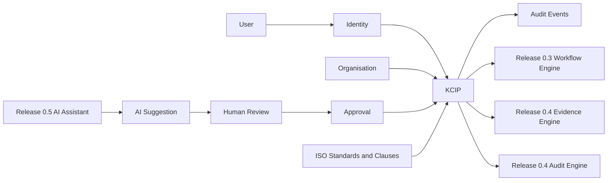
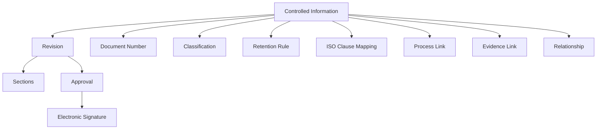
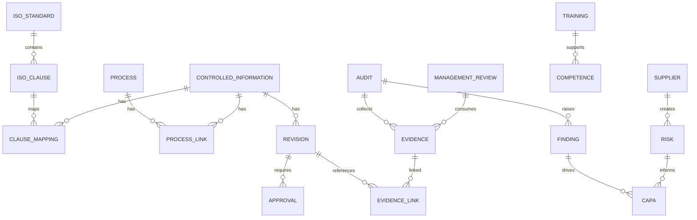
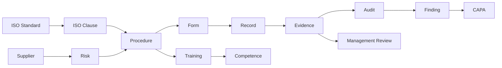
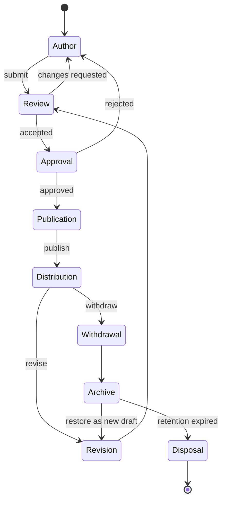

# SPEC-0001: Knowledge & Controlled Information Platform

Status: Planning Complete

Release: 0.2

Owner: Product Governance

Related Documents:

- [Product Vision](../product/PRODUCT_VISION.md)
- [Product Roadmap](../product/PRODUCT_ROADMAP.md)
- [Domain Model](../product/DOMAIN_MODEL.md)
- [Architecture Decisions](../product/ARCHITECTURE_DECISIONS.md)

## 1. Executive Summary

### Purpose

The Knowledge & Controlled Information Platform, abbreviated KCIP, establishes the core Certisphere capability for governing controlled information across ISO management systems. KCIP provides the structures, lifecycle, revision control, numbering, permissions, auditability, and integration contracts required to manage policies, procedures, forms, registers, checklists, templates, records, evidence links, and clause mappings.

### Business Objectives

- Replace uncontrolled shared-drive document practices with governed information lifecycle management.
- Enable organisations to prove that controlled information is current, approved, published, traceable, and retained.
- Provide a foundation for ISO 9001, ISO 14001, ISO 27001, and future management standards.
- Prepare the platform for workflow automation, audit evidence, AI assistance, and certification readiness reporting.
- Preserve human accountability for all controlled changes.

### Scope

Release 0.2 covers engineering specification for:

- Controlled information domain model.
- Document and template structure.
- Revision control and lifecycle states.
- Numbering engine architecture.
- Relationship model for standards, clauses, processes, evidence, risk, audit, CAPA, suppliers, training, competence, and management review.
- REST API design.
- Database design.
- Security, retention, electronic signatures, and audit trail requirements.
- Migration strategy for uploaded Word documents.
- Implementation sprint plan.

### Out of Scope

- Application implementation.
- API implementation.
- Prisma schema changes.
- Database migrations.
- Workflow engine implementation.
- Evidence engine implementation.
- AI assistant implementation.
- UI implementation.
- Bulk migration execution.

### Dependencies

- Identity and Organisation bounded contexts.
- Tenant isolation and RBAC.
- Immutable audit event foundation.
- PostgreSQL and Prisma migration workflow.
- Future Release 0.3 Workflow Engine.
- Future Release 0.4 Audit & Evidence Engine.
- Future Release 0.5 AI Quality Assistant.

### Success Criteria

- Engineering teams can implement Release 0.2 without needing product reinterpretation.
- Every controlled information entity has purpose, relationships, lifecycle, validation rules, and extension points.
- API and database designs are specific enough for implementation planning.
- AI, workflow, audit, evidence, and standards integrations are defined without implementing them.
- The implementation plan is divided into sequenced sprints with dependencies and risks.

## 2. Product Principles

### Controlled Information First

Every controlled artefact must have ownership, classification, lifecycle state, revision history, access policy, approval status, and retention policy.

### Evidence First

KCIP must produce evidence of control by default: authorship, review, approval, publication, distribution, withdrawal, archive, and disposal events.

### AI Assists

AI may draft, summarise, compare, classify, and suggest relationships. AI output is always advisory until accepted by an authorised human.

### Human Approval Required

No controlled information can be published, withdrawn, restored, or disposed without a human approval path.

### Multi-standard by Design

KCIP must support mapping controlled information to multiple ISO standards and clauses without duplicating content.

### API First

Every business capability must have a documented API contract before implementation. UI workflows consume the same business APIs.

### SaaS First

All data and access checks must be organisation-scoped. Cross-tenant access must fail by design.

### Security by Default

Sensitive records require least-privilege access, immutable audit history, encrypted storage where appropriate, and secure retention controls.

### Auditor Friendly

Auditors must be able to inspect published information, approvals, revisions, evidence links, and clause mappings without seeing unauthorised drafts.

### Offline Capability

The domain must support future offline evidence packs, export bundles, and controlled read-only review packages.

## 3. Architecture Overview

KCIP is a bounded capability within the Documents and Knowledge domain. It depends on Identity and Organisation for authentication, tenant isolation, membership, and RBAC. It publishes audit events and exposes integration seams for future Workflow, Evidence, Audit, and AI capabilities.

### Authentication Integration

All KCIP endpoints require authenticated principals except explicitly public read-only resources, which are not planned for Release 0.2. Access tokens must include user identity, organisation identity, session identity, and permissions.

### Organisation Integration

Every KCIP entity belongs to an organisation. Organisation membership and access policy determine whether a user can author, review, approve, publish, audit, or administer controlled information.

### Workflow Engine Integration

Release 0.2 defines workflow integration contracts but does not implement Release 0.3. KCIP must model review and approval states so they can later be delegated to a reusable workflow engine.

### Audit Engine Integration

KCIP exposes clause mappings, current documents, revision history, approvals, and evidence links for audits. Release 0.4 will consume these structures.

### Evidence Engine Integration

KCIP can link records and documents to future evidence objects. Release 0.2 stores link intent and metadata; Release 0.4 will own full evidence capture and verification.

### AI Assistant Integration

AI suggestions are separate from controlled information until reviewed and approved. AI cannot publish, delete, withdraw, or dispose controlled information.

### Future Standards Integration

ISO standards and clauses must be modeled as reusable reference data. Controlled information may map to many clauses across many standards.

## 4. Domain Model

Each entity below extends the governing business model in [Domain Model](../product/DOMAIN_MODEL.md).

### Controlled Information

Purpose: Governs information requiring control for conformance, operation, certification, or evidence.

Responsibilities: Own lifecycle, metadata, classification, access policy, numbering, current revision, and retention.

Relationships: Has revisions, owner, category, classification, access policy, retention rule, clause mappings, process links, relationships, attachments, comments, and reviews.

Lifecycle: Draft, in review, approved, published, superseded, withdrawn, archived, disposed.

Validation Rules: Must belong to an organisation; must have type, title, owner, category, classification, lifecycle state, and document number before publication.

Future Extensions: External sharing, legal hold, multilingual variants, distribution acknowledgement.

### Document

Purpose: Represents a controlled information item with authored content.

Responsibilities: Store document-level identity, type, title, owner, lifecycle, and current revision.

Relationships: Specialises controlled information; contains revisions, sections, approvals, comments, attachments, and relationships.

Lifecycle: Created, drafted, reviewed, approved, published, revised, withdrawn, archived.

Validation Rules: Title and type are required; current revision must be approved before publication.

Future Extensions: Collaborative editing, PDF rendering, Word export.

### Template

Purpose: Provides reusable controlled structure for future documents, forms, checklists, and registers.

Responsibilities: Define section structure, required metadata, default classification, numbering pattern, and lifecycle workflow.

Relationships: Used by documents, forms, registers, checklists, and sections.

Lifecycle: Draft, approved, published, retired.

Validation Rules: Published templates must have a version, owner, approved revision, and compatible content type.

Future Extensions: Marketplace templates, customer-specific template libraries.

### Section

Purpose: Represents a structured content block inside a revision.

Responsibilities: Store ordered content, heading, body, embedded controls, and optional clause references.

Relationships: Belongs to a revision; may link to clauses, evidence, comments, and AI suggestions.

Lifecycle: Draft, revised, approved as part of revision, superseded.

Validation Rules: Must belong to one revision; sequence must be unique within a revision.

Future Extensions: Rich structured editing, reusable clauses, controlled snippets.

### Revision

Purpose: Represents a controlled version of a document or template.

Responsibilities: Preserve content snapshot, version number, change summary, author, approval status, and publication state.

Relationships: Belongs to controlled information; contains sections; has approvals, comments, attachments, and signatures.

Lifecycle: Draft, in review, approved, published, superseded, withdrawn.

Validation Rules: Version number must be unique within controlled information; published revision must have completed approval.

Future Extensions: Side-by-side comparison, restoration, redline export.

### Approval

Purpose: Captures authorised acceptance of a revision or lifecycle transition.

Responsibilities: Store requested action, decision, approver, outcome, timestamp, and audit linkage.

Relationships: Contains approval steps; references revision, workflow, electronic signature, and audit event.

Lifecycle: Requested, in progress, approved, rejected, withdrawn, expired.

Validation Rules: Approver must have permission at decision time; approved action must match requested action.

Future Extensions: Delegation, approval matrix, conditional approval.

### Approval Step

Purpose: Represents one required decision in an approval sequence.

Responsibilities: Define assignee, role requirement, due date, sequence, decision, and comments.

Relationships: Belongs to approval; may become workflow task in Release 0.3.

Lifecycle: Pending, assigned, approved, rejected, skipped, expired.

Validation Rules: Step sequence must be deterministic; final approval requires all mandatory steps complete.

Future Extensions: Parallel approvals, quorum rules.

### Relationship

Purpose: Links KCIP entities to other management system entities for traceability.

Responsibilities: Store source, target, relationship type, rationale, and status.

Relationships: Connects documents, clauses, processes, evidence, risks, CAPAs, audits, suppliers, training, competence, and management reviews.

Lifecycle: Proposed, active, reviewed, removed.

Validation Rules: Source and target must exist within authorised tenant scope; relationship type must be allowed.

Future Extensions: Graph impact analysis, AI-suggested links.

### Attachment

Purpose: Stores supporting files associated with a controlled revision or comment.

Responsibilities: Track filename, MIME type, size, checksum, storage location, classification, and retention.

Relationships: Belongs to revision, comment, review, or evidence link.

Lifecycle: Uploaded, scanned, accepted, superseded, archived, disposed.

Validation Rules: Must pass file type, size, malware, and classification checks.

Future Extensions: OCR, preview generation, external evidence ingestion.

### Evidence Link

Purpose: Links controlled information to objective evidence without owning the evidence lifecycle.

Responsibilities: Store reference, relationship type, evidence status, and verification metadata.

Relationships: Connects controlled information to future Evidence Engine records.

Lifecycle: Proposed, active, verified, superseded, removed.

Validation Rules: Evidence link must identify target evidence or external reference; verified links require reviewer identity.

Future Extensions: Evidence packs, auditor exports.

### Clause Mapping

Purpose: Maps controlled information to ISO standards and clauses.

Responsibilities: Store standard, clause, coverage type, rationale, and review status.

Relationships: Links document, section, process, evidence, and audit criteria.

Lifecycle: Proposed, active, reviewed, superseded, removed.

Validation Rules: Clause must exist in active standard library; coverage type is required.

Future Extensions: AI-assisted gap analysis, multi-standard coverage dashboards.

### Process Link

Purpose: Links controlled information to business processes.

Responsibilities: Identify process ownership, applicability, and process relationship type.

Relationships: Connects documents, procedures, forms, records, training, risks, and audits.

Lifecycle: Proposed, active, reviewed, removed.

Validation Rules: Linked process must be active or under review.

Future Extensions: Process maps, KPI integration.

### Workflow

Purpose: Represents a future workflow contract for reviews, approvals, and lifecycle transitions.

Responsibilities: Hold workflow reference, status, assigned tasks, and transition outcome.

Relationships: Connected to approval, review, revision, and audit events.

Lifecycle: Not started, active, completed, cancelled.

Validation Rules: Release 0.2 may store workflow references but must not implement workflow engine logic.

Future Extensions: Release 0.3 workflow orchestration.

### Electronic Signature

Purpose: Provides legally and operationally meaningful evidence of user approval.

Responsibilities: Store signer identity, meaning of signature, timestamp, authentication context, and integrity metadata.

Relationships: Linked to approval step, revision, audit event, and user.

Lifecycle: Requested, signed, invalidated by supersession.

Validation Rules: Signer must be authenticated; signature must include explicit meaning and target revision.

Future Extensions: Advanced electronic signatures, certificate-backed signatures.

### Comment

Purpose: Supports review discussion without changing controlled content.

Responsibilities: Store author, content, target, resolution status, and visibility.

Relationships: Belongs to revision, section, review, approval step, or AI suggestion.

Lifecycle: Open, replied, resolved, archived.

Validation Rules: Comment visibility must respect access policy.

Future Extensions: Threaded discussions, mentions, exportable review log.

### Review

Purpose: Coordinates human assessment before approval or publication.

Responsibilities: Track reviewers, scope, comments, outcomes, and required changes.

Relationships: Belongs to revision and may produce approval request.

Lifecycle: Requested, in progress, changes requested, accepted, closed.

Validation Rules: Review cannot close successfully while mandatory unresolved comments remain.

Future Extensions: Periodic review scheduling, review effectiveness metrics.

### Lifecycle State

Purpose: Defines allowed state of controlled information and revision.

Responsibilities: Control valid transitions and required permissions.

Relationships: Applied to controlled information, revision, approval, archive, and workflow.

Lifecycle: Draft, review, approved, published, obsolete, superseded, withdrawn, archived, disposed.

Validation Rules: Transitions must follow defined state machine.

Future Extensions: Customer-configurable states constrained by governance.

### Document Number

Purpose: Provides unique controlled identification.

Responsibilities: Generate, reserve, assign, retire, and preserve numbers.

Relationships: Belongs to controlled information; generated from numbering rule and family.

Lifecycle: Reserved, assigned, retired.

Validation Rules: Number must be unique within organisation and document family.

Future Extensions: Site prefixes, standard prefixes, legacy number migration.

### Metadata

Purpose: Stores structured descriptive information.

Responsibilities: Capture owner, process, classification, category, standard, review date, and retention attributes.

Relationships: Belongs to controlled information, revision, template, and archive.

Lifecycle: Drafted, validated, approved, revised.

Validation Rules: Required metadata varies by type and lifecycle state.

Future Extensions: Custom fields with validation.

### Classification

Purpose: Defines confidentiality and handling rules.

Responsibilities: Control visibility, sharing, export, and retention sensitivity.

Relationships: Applied to controlled information, attachments, comments, and evidence links.

Lifecycle: Defined, active, deprecated.

Validation Rules: Classification is required before publication.

Future Extensions: Data loss prevention policies.

### Category

Purpose: Groups controlled information by type or business use.

Responsibilities: Support navigation, reporting, default metadata, and numbering.

Relationships: Applied to documents, templates, forms, registers, and checklists.

Lifecycle: Proposed, active, retired.

Validation Rules: Category must be active to assign to new controlled information.

Future Extensions: Customer taxonomy management.

### Owner

Purpose: Identifies accountable user or role for controlled information.

Responsibilities: Maintain accountability for content, review, publication, and periodic review.

Relationships: User or role linked to controlled information, process, review, and workflow.

Lifecycle: Assigned, transferred, removed.

Validation Rules: Published controlled information requires an active owner.

Future Extensions: Delegated ownership, ownership review.

### Access Policy

Purpose: Defines who can view, author, review, approve, publish, export, or administer controlled information.

Responsibilities: Store permission rules by role, user, group, and external auditor access.

Relationships: Applied to controlled information, revision, attachment, and comment.

Lifecycle: Draft, active, revised, retired.

Validation Rules: Must not grant access outside organisation unless explicit external sharing exists.

Future Extensions: Attribute-based access control.

### Retention Rule

Purpose: Defines how long information and records must be retained and when disposal can occur.

Responsibilities: Store retention period, trigger event, disposition action, and legal hold status.

Relationships: Applied to controlled information, record, attachment, archive, and evidence link.

Lifecycle: Draft, active, reviewed, retired.

Validation Rules: Disposal cannot occur before retention expiry or while legal hold is active.

Future Extensions: Jurisdiction-specific retention libraries.

### Archive

Purpose: Preserves inactive or superseded controlled information.

Responsibilities: Store archived state, archive reason, retention metadata, and restoration eligibility.

Relationships: References controlled information, revision, approval, retention rule, and audit events.

Lifecycle: Archived, retained, restored, disposed.

Validation Rules: Archive must preserve revision and approval history.

Future Extensions: Offline archive export and legal hold vault.

## 5. Relationship Model

KCIP enables traceability from standards and clauses through processes, controlled information, evidence, audits, findings, risks, CAPAs, suppliers, training, competence, and management reviews.

## 6. Revision Control

### Version Numbering

- Draft revisions use internal draft identifiers.
- Published revisions use semantic document revision numbers: `1.0`, `1.1`, `2.0`.
- Major revision increments indicate material change requiring approval.
- Minor revision increments indicate controlled but lower-impact change.
- The current published revision is immutable.

### States

- Draft: editable by authorised authors.
- Review: locked for reviewer assessment except controlled change responses.
- Approved: accepted by approvers but not yet published.
- Published: current effective controlled version.
- Obsolete: no longer applicable but preserved for history.
- Superseded: replaced by a newer published revision.
- Withdrawn: intentionally removed from active use.

### Electronic Signatures

Approvals require electronic signatures containing signer identity, authenticated session, signature meaning, timestamp, target revision, and audit event reference.

### Approval History

Approval history is immutable and includes requested action, approver, decision, comments, timestamp, and signature.

### Change History

Change history includes author, changed fields, change summary, previous revision, new revision, and reason for change.

### Comparison Engine

Release 0.2 must define comparison requirements for future implementation:

- Compare revision metadata.
- Compare section order and content.
- Identify added, removed, and changed sections.
- Export comparison for reviewers and auditors.

### Restore Previous Versions

Restoration never mutates historical revisions. A restore action creates a new draft revision based on a previous revision and requires normal review and approval.

## 7. Numbering Engine

### Architecture

The numbering engine generates unique identifiers from organisation, document family, information type, optional process or standard prefix, sequence, and revision.

Example pattern:

`{ORG}-{TYPE}-{FAMILY}-{SEQUENCE}`

### Supported Numbered Types

- Procedures
- Forms
- Registers
- Checklists
- Policies
- Manuals
- Evidence
- Templates

### Automatic Numbering

Numbers are generated from active numbering rules. Assignment must be transactional to avoid duplicates.

### Reserved Numbers

Users with permission may reserve numbers for planned documents. Reserved numbers expire or are released through explicit action.

### Retired Numbers

Retired numbers cannot be reused. They remain available for traceability and migration history.

### Document Families

Families group related artefacts such as a procedure, related forms, checklist, and register.

### Multi-standard Numbering

Numbering rules may include standard prefixes when a document primarily supports a standard, but one document may still map to multiple standards through clause mappings.

## 8. Document Lifecycle

### Lifecycle Requirements

- Author: editable by authorised authors.
- Review: reviewer comments and required changes are tracked.
- Approval: approvers sign the exact revision.
- Publication: published revision becomes read-only current version.
- Distribution: authorised users can access current controlled information.
- Revision: new draft is created from current or previous revision.
- Withdrawal: controlled information is removed from active use.
- Archive: all history and records are preserved.
- Disposal: only allowed after retention expiry and approval.

## 9. Permissions

### Roles

- Author
- Reviewer
- Approver
- Quality Manager
- Auditor
- External Auditor
- Administrator
- System Administrator
- Organisation Owner

### Permission Matrix

| Capability           | Author | Reviewer | Approver | Quality Manager | Auditor | External Auditor | Administrator | System Administrator | Organisation Owner |
| -------------------- | ------ | -------- | -------- | --------------- | ------- | ---------------- | ------------- | -------------------- | ------------------ |
| View published       | Yes    | Yes      | Yes      | Yes             | Yes     | Yes              | Yes           | Yes                  | Yes                |
| View draft           | Own    | Assigned | Assigned | Yes             | No      | No               | Yes           | Yes                  | Yes                |
| Create draft         | Yes    | No       | No       | Yes             | No      | No               | Yes           | Yes                  | Yes                |
| Edit draft           | Own    | No       | No       | Yes             | No      | No               | Yes           | Yes                  | Yes                |
| Submit review        | Yes    | No       | No       | Yes             | No      | No               | Yes           | Yes                  | Yes                |
| Review               | No     | Assigned | No       | Yes             | No      | No               | Yes           | Yes                  | Yes                |
| Approve              | No     | No       | Assigned | Yes             | No      | No               | Configurable  | Yes                  | Yes                |
| Publish              | No     | No       | No       | Yes             | No      | No               | Yes           | Yes                  | Yes                |
| Withdraw             | No     | No       | No       | Yes             | No      | No               | Yes           | Yes                  | Yes                |
| Archive              | No     | No       | No       | Yes             | No      | No               | Yes           | Yes                  | Yes                |
| Export evidence pack | No     | No       | No       | Yes             | Yes     | Assigned         | Yes           | Yes                  | Yes                |
| Configure numbering  | No     | No       | No       | Yes             | No      | No               | Yes           | Yes                  | Yes                |
| Manage access policy | No     | No       | No       | Yes             | No      | No               | Yes           | Yes                  | Yes                |

All permission checks must include organisation scope and access policy.

## 10. Workflow Integration

Release 0.2 stores workflow intent and lifecycle states. Release 0.3 will own reusable workflow definitions, task routing, escalation, reminders, and workflow execution.

KCIP must expose:

- Workflow start event for review and approval.
- Approval step requirements.
- Transition commands.
- Status query.
- Audit event hooks.

KCIP must not implement a general-purpose workflow engine in Release 0.2.

## 11. Evidence Integration

Release 0.2 supports evidence links. Release 0.4 owns evidence capture, verification, audit execution, findings, and evidence packs.

KCIP must support:

- Linking revisions to existing or external evidence references.
- Classifying evidence relationship type.
- Recording verification status.
- Exposing current published documents for audit evidence collection.

## 12. AI Integration

AI integration is future Release 0.5 capability and must follow these rules:

- AI never publishes controlled information.
- AI suggestions require human approval.
- AI actions are auditable.
- AI cannot delete controlled information.
- AI cannot withdraw, archive, dispose, or restore controlled information.
- AI-generated content is stored as suggestion data until accepted.
- Accepted AI suggestions become human-authored controlled changes with audit linkage.

## 13. REST API Design

These endpoints are design contracts only and must not be implemented in this planning release.

| URI                                         | Method | Purpose                             | Authentication | Authorisation                  | Validation                                   | Response Model                        |
| ------------------------------------------- | ------ | ----------------------------------- | -------------- | ------------------------------ | -------------------------------------------- | ------------------------------------- |
| `/v1/controlled-information`                | POST   | Create controlled information draft | Bearer JWT     | `kcip.create`                  | title, type, owner, category, classification | `ControlledInformationResponse`       |
| `/v1/controlled-information`                | GET    | Search controlled information       | Bearer JWT     | `kcip.read`                    | filters, pagination, organisation scope      | `ControlledInformationSearchResponse` |
| `/v1/controlled-information/{id}`           | GET    | Get controlled information detail   | Bearer JWT     | `kcip.read` plus access policy | UUID path                                    | `ControlledInformationDetailResponse` |
| `/v1/controlled-information/{id}/revisions` | POST   | Create revision draft               | Bearer JWT     | `kcip.revisions.create`        | source revision, change summary              | `RevisionResponse`                    |
| `/v1/revisions/{revisionId}/sections`       | PUT    | Replace draft sections              | Bearer JWT     | `kcip.revisions.edit`          | ordered sections, draft state                | `RevisionResponse`                    |
| `/v1/revisions/{revisionId}/review`         | POST   | Submit revision for review          | Bearer JWT     | `kcip.review.submit`           | required metadata complete                   | `ReviewResponse`                      |
| `/v1/reviews/{reviewId}/comments`           | POST   | Add review comment                  | Bearer JWT     | assigned reviewer or owner     | target, comment body                         | `CommentResponse`                     |
| `/v1/revisions/{revisionId}/approval`       | POST   | Request approval                    | Bearer JWT     | `kcip.approval.request`        | review complete, approvers                   | `ApprovalResponse`                    |
| `/v1/approvals/{approvalId}/steps/{stepId}` | POST   | Record approval decision            | Bearer JWT     | assigned approver              | decision, signature meaning                  | `ApprovalStepResponse`                |
| `/v1/revisions/{revisionId}/publish`        | POST   | Publish approved revision           | Bearer JWT     | `kcip.publish`                 | approved state                               | `PublicationResponse`                 |
| `/v1/controlled-information/{id}/withdraw`  | POST   | Withdraw active information         | Bearer JWT     | `kcip.withdraw`                | reason, approval reference                   | `LifecycleResponse`                   |
| `/v1/controlled-information/{id}/archive`   | POST   | Archive inactive information        | Bearer JWT     | `kcip.archive`                 | retention rule, reason                       | `ArchiveResponse`                     |
| `/v1/numbering/reservations`                | POST   | Reserve document number             | Bearer JWT     | `kcip.number.reserve`          | family, type, expiry                         | `DocumentNumberResponse`              |
| `/v1/templates`                             | GET    | List templates                      | Bearer JWT     | `kcip.templates.read`          | type, category, status                       | `TemplateSearchResponse`              |

All endpoints require request validation, structured errors, request logging, correlation ID, OpenAPI documentation, audit logging where state changes occur, and organisation-aware access control.

## 14. Database Design

This section describes tables only. It does not implement Prisma.

### Tables

- `controlled_information`
- `documents`
- `templates`
- `sections`
- `revisions`
- `approvals`
- `approval_steps`
- `relationships`
- `attachments`
- `evidence_links`
- `clause_mappings`
- `process_links`
- `workflow_references`
- `electronic_signatures`
- `comments`
- `reviews`
- `lifecycle_states`
- `document_numbers`
- `metadata_definitions`
- `classifications`
- `categories`
- `owners`
- `access_policies`
- `retention_rules`
- `archives`

### Required Common Columns

Tenant-owned tables require UUID primary key, `organisation_id`, `created_by`, `updated_by`, `created_at`, `updated_at`, optional `deleted_at`, and version where optimistic concurrency is needed.

### Indexes

- Organisation and lifecycle state.
- Organisation and document number.
- Organisation and owner.
- Organisation and classification.
- Organisation and category.
- Full-text search vector for title, number, summary, metadata, and section content.
- Clause mapping by standard and clause.
- Process link by process.
- Evidence link by target evidence.

### Constraints

- Document number unique per organisation and family.
- Revision number unique per controlled information.
- Published revision unique per controlled information.
- Approval step sequence unique per approval.
- Relationship source and target must be valid entity references.
- Retention disposal cannot occur before retention expiry.

### Retention

Retention rules apply to controlled information, revisions, records, attachments, evidence links, and archives. Disposal requires approval and must preserve disposal audit evidence.

## 15. Security

### Encryption

- Transport encryption is required in all deployed environments.
- Sensitive storage must use provider-managed encryption.
- Secrets must never be stored in controlled content or metadata.

### Audit Trail

Every state-changing action emits immutable audit events with actor, organisation, action, target, timestamp, correlation ID, and metadata.

### Version History

Published revisions are immutable. Historical revisions must remain retrievable according to retention policy.

### Immutable Approvals

Approval decisions and electronic signatures cannot be edited. Corrections require new approval events.

### Electronic Signatures

Signatures must bind user identity, authentication context, approval meaning, target revision, and timestamp.

### Data Retention

Retention rules must prevent premature deletion and support legal hold.

### Backups

Database backups must preserve controlled information, approvals, signatures, and audit trails. Restore procedures must maintain referential integrity.

## 16. Performance

### Expected Volumes

- Organisations: 1,000 in early SaaS scale.
- Users: 100,000 across tenants.
- Controlled information items: 10,000 per large organisation.
- Revisions: 20 per controlled information item over long-term use.
- Attachments and evidence references: 1,000,000 across tenants.
- Clause mappings: 100,000 across standards and organisations.

### Targets

- Search results return within 500 ms for indexed tenant-scoped queries.
- Document detail returns within 300 ms excluding large attachment download.
- Revision creation completes within 1 second for typical documents.
- Approval decision persists within 500 ms.
- Publication transaction completes within 2 seconds for typical revisions.
- Export jobs may be asynchronous for large documents or evidence packs.

## 17. Migration Strategy

Existing uploaded Word documents must become structured controlled information through a governed migration flow:

1. Ingest source file and preserve original checksum.
2. Extract metadata, headings, sections, tables, and embedded references.
3. Classify document type and proposed category.
4. Assign or reserve document number.
5. Create draft controlled information and draft revision.
6. Store source file as attachment.
7. Present extracted structure for human review.
8. Require owner confirmation and metadata completion.
9. Route through review and approval.
10. Publish only after human approval.

Migration must preserve original files, extraction confidence, human corrections, approval history, and audit events.

## 18. Implementation Plan

### Sprint 2.1: Domain Model

Objectives: Define KCIP entities, value objects, lifecycle state machine, domain events, and repository ports.

Deliverables: Domain models, validation rules, state transitions, domain tests, architecture notes.

Definition of Done: Domain tests pass; lifecycle transitions are explicit; no persistence implementation is required.

Dependencies: Release 0.1 Identity and Organisation.

Risks: Overloading document concepts before controlled information abstractions are stable.

### Sprint 2.2: Database

Objectives: Implement Prisma schema and migrations for KCIP persistence.

Deliverables: Prisma models, migrations, indexes, constraints, seed data, rollback validation.

Definition of Done: Prisma validates; migrations apply, rollback, and reapply against PostgreSQL.

Dependencies: Sprint 2.1 domain model.

Risks: Relationship polymorphism and full-text search design may need iteration.

### Sprint 2.3: API

Objectives: Implement REST contracts with validation, OpenAPI, structured errors, auth, authz, audit logging, and correlation IDs.

Deliverables: Controllers, DTOs, application services, integration tests, API docs.

Definition of Done: API tests pass; OpenAPI generated; every endpoint enforces organisation access.

Dependencies: Sprint 2.2 persistence.

Risks: Endpoint scope creep into workflow execution.

### Sprint 2.4: Authoring Engine

Objectives: Implement draft authoring, sections, metadata, templates, comments, and attachments.

Deliverables: Authoring APIs, frontend authoring workflows, validation, tests.

Definition of Done: Users can create and edit draft controlled information without publishing.

Dependencies: Sprint 2.3 API.

Risks: Rich text complexity and attachment security.

### Sprint 2.5: Revision Engine

Objectives: Implement revision creation, versioning, comparison requirements, restore-as-draft, and immutable history.

Deliverables: Revision APIs, comparison model, restore flow, tests.

Definition of Done: Published revisions cannot mutate; restore creates new draft revision.

Dependencies: Sprint 2.4 authoring.

Risks: Version numbering rules may conflict with legacy migrated documents.

### Sprint 2.6: Approval Engine

Objectives: Implement review, approval steps, electronic signatures, publication, withdrawal, and archive transitions.

Deliverables: Approval APIs, signature persistence, lifecycle transition guards, audit events.

Definition of Done: Controlled information can move from draft to published through human approval.

Dependencies: Sprint 2.5 revision engine.

Risks: Approval matrix requirements may need workflow engine features not yet implemented.

### Sprint 2.7: Evidence Links

Objectives: Implement clause mappings, process links, evidence links, and relationship management.

Deliverables: Relationship APIs, traceability queries, mapping tests.

Definition of Done: Published information can be traced to clauses, processes, and evidence references.

Dependencies: Sprint 2.6 approval engine.

Risks: Relationship model may need optimisation for reporting queries.

### Sprint 2.8: Testing

Objectives: Complete unit, integration, API, security, permission, lifecycle, and migration tests.

Deliverables: Test suites, fixtures, API contract tests, audit tests, RBAC tests.

Definition of Done: Zero failing tests; coverage meets release gate; permission and tenant isolation tests pass.

Dependencies: Sprints 2.1 through 2.7.

Risks: Test data complexity for multi-standard relationships.

### Sprint 2.9: Release Candidate

Objectives: Validate KCIP end-to-end in Docker and CI.

Deliverables: Docker stack validation, migration validation, release notes, updated product status.

Definition of Done: CI green; Docker stack starts; migrations apply and rollback; release candidate accepted.

Dependencies: Sprint 2.8 testing and Milestone 1.2F runtime environment.

Risks: Runtime environment readiness and storage performance.

## 19. Backlog Update Requirement

The Release 0.2 backlog is maintained in [Product Backlog](../product/BACKLOG.md). This specification defines the implementation guide for those backlog items.

## 20. Roadmap Update Requirement

The Release 0.2 planning status is maintained in [Product Roadmap](../product/PRODUCT_ROADMAP.md).

## 21. Project Status Update Requirement

Release 0.2 planning status is maintained in [Project Status](../PROJECT_STATUS.md). Implementation must remain Not Started until Release 0.2 engineering work is explicitly authorised.
